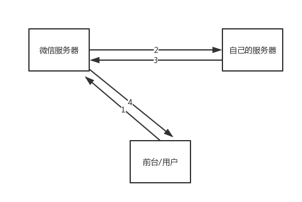

# 微信裂变记录

场景：已关注用户回复关键字获取自己的专属海报，邀请他人扫码海报，并关注本公众号，以达到微信粉丝增长的目的。

进行微信开发，首先是，基本开发中的服务器配置，建议大家参考[入门指引](https://mp.weixin.qq.com/wiki?t=resource/res_main&id=mp1472017492_58YV5 "入门指引")，很简单，参照着设置一下很快就好了。不过最后要点击一下右上角的“启用”按钮，否则，微信服务器接受不到我们自己的服务器的响应，导致我们的服务器的url设置不成功。成功之后的截图如下：


然后设置好access_token , 微信开发离不开access_token的验证，才能使用微信提供的各种接口。微信服务器(公众平台)，自己的服务器，自己的项目前台的关系如下图所示：


配置好环境之后，可以开开心心的开发啦😄

## 第一步，接受到关注用户的请求。

处理用户的请求的逻辑都在本服务器中进行，那么先要解决的事情是怎样让服务器接收到用户的消息呢？
我的后台使用的是koa2搭建的，接受微信服务器发来的消息都是xml格式的,使用parsePostData就可以得到完整的xml数据了。

``` js
// 解析上下文里 node 原生请求的 POST 参数
function parsePostData(ctx) {
    return new Promise((resovle, reject) => {
        try {
            let postData = "";
            //  ctx.req 是原生 HTTP 请求对象
            ctx.req.on("data", (data) => {
                postData += data;
            });
            ctx.req.on("end", () => {
                resovle(postData);
            })
        } catch (err) {
            reject(err);
        }
    });
}

```

## 接受文本消息

当用户在公众号的对话框中发送任何消息时，我们配置的服务器都会收到来自微信服务器的xml消息。

``` xml
<xml>
 <ToUserName><![CDATA[gh_69b9829760d6]]></ToUserName>
 <FromUserName><![CDATA[o92L_1dye9BhzOpQEYARNLSgg0BM]]></FromUserName>
 <CreateTime>1538397268</CreateTime>
 <MsgType><![CDATA[text]]></MsgType>
 <Content><![CDATA[托福备考]]></Content>
 <MsgId>6607365954744739874</MsgId>
</xml>

```

解释：
createTime 是微信公众平台记录粉丝发送该消息的具体时间

text: 用于标记该xml 是文本消息，一般用于区别判断

托福备考: 说明该粉丝发给公众号的具体内容是托福备考

MsgId: 是公众平台为记录识别该消息的一个标记数值, 微信后台系统自动产生

为了方便的解析XML内容，我使用了`xml2js`这个包，写了一个函数来解析接受到的xml数据。

``` js
const {parseString} = require('xml2js');
function parseXML(xml) {
    try {
        return new Promise((resolve, reject) => {
            parseString(xml,  (err, result) => {
                err && console.log(err);
                resolve(result);
            })
        })
    }catch (e) {
        throw (e);
    }
}
```

当判断得到用户发来了关键字之后，就要回复用户一段文字和一张海报，我们先做到回复文字。

## 被动回复文本消息

这些强烈推荐入门指引[https://mp.weixin.qq.com/wiki?t=resource/res_main&id=mp1472017492_58YV5](https://mp.weixin.qq.com/wiki?t=resource/res_main&id=mp1472017492_58YV5)