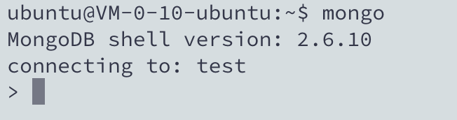

# Ubuntu下MongoDB的安装和使用

## 一、安装

首先安装前用命令：sudo apt-get update更新一下软件源，再安装install

```bash
sudo apt-get update
```

```shell
sudo apt-get install mongodb
```

安装完成后，在终端输入以下命令查看MongoDB版本：

```bash
mongo -version
```

##二、启动和关闭

启动和关闭mongodb命令如下：

```shell
service mongodb start
service mongodb stop
```

默认设置MongoDB是随Ubuntu启动自动启动的。 
输入以下命令查看是否启动成功：

```bash
pgrep mongo -l   #注意：-l是英文字母l，不是阿拉伯数字1
```


卸载MongoDB

```bash
sudo apt-get --purge remove mongodb mongodb-clients mongodb-server
```

## 三、使用MongoDB

### shell命令模式

输入`mongo`进入shell命令模式，默认连接的数据库是test数据库，在此之前一定要确保你已经启动了MongoDB，否则会出现错误，启动之后运行成功，如下截图：



**常用操作命令：**

<u>数据库相关</u> 
`show dbs`:显示数据库列表 
`show collections`：显示当前数据库中的集合（类似关系数据库中的表table） 
`show users`：显示所有用户 
`use yourDB`：切换当前数据库至yourDB 
`db.help() `：显示数据库操作命令 
`db.yourCollection.help() `：显示集合操作命令，yourCollection是集合名 

MongoDB没有创建数据库的命令，如果你想创建一个“School”的数据库，先运行`use School`命令，之后做一些操作（如：创建聚集集合`db.createCollection('teacher')`）,这样就可以创建一个名叫“School”的数据库。截图如下： 

 


下面以一个School数据库为例，在School数据库中创建两个集合teacher和student，并对student集合中的数据进行增删改查基本操作（集合Collection相当于关系型数据库中的表table）。 

1. 切换到School数据库

```
use School  #切换到School数据库。MongoDB 无需预创建School数据库，在使用时会自动创建
```

2. 创建Collection

```bash
db.createCollection('teacher') #创建一个聚集集合。MongoDB 其实在插入数据的时候，也会自动创建对应的集合，无需预定义集合
```

截图如下： 


3. 插入数据 
   与数据库创建类似，插入数据时也会自动创建集合。 
   插入数据有两种方式：insert和save。

```bash
db.student.insert({_id:1, sname: 'zhangsan', sage: 20}) #_id可选
```

```bash
db.student.save({_id:1, sname: 'zhangsan', sage: 22}) #_id可选
```

这两种方式，其插入的数据中_id字段均可不写，会自动生成一个唯一的_id来标识本条数据。而insert和save不同之处在于：在手动插入_id字段时，如果_id已经存在，insert不做操作，save做更新操作；如果不加_id字段，两者作用相同都是插入数据。

### Node API 编程实例


