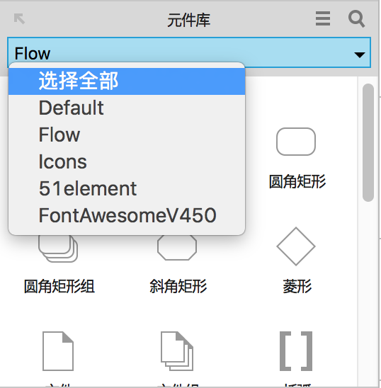
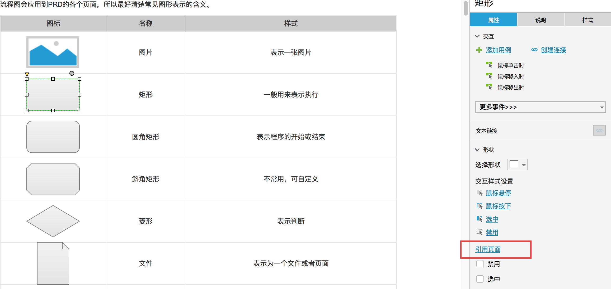
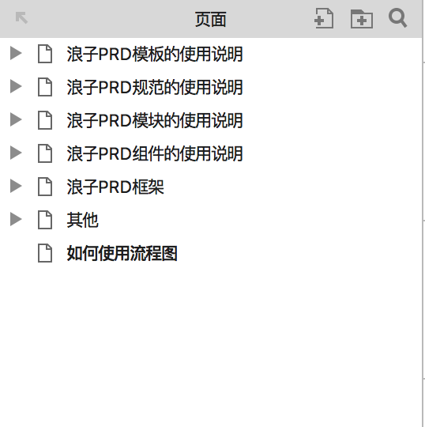
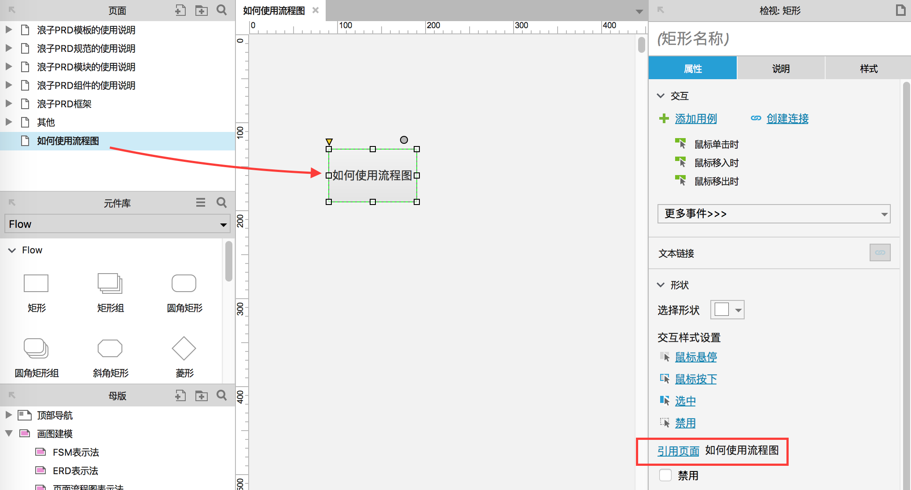
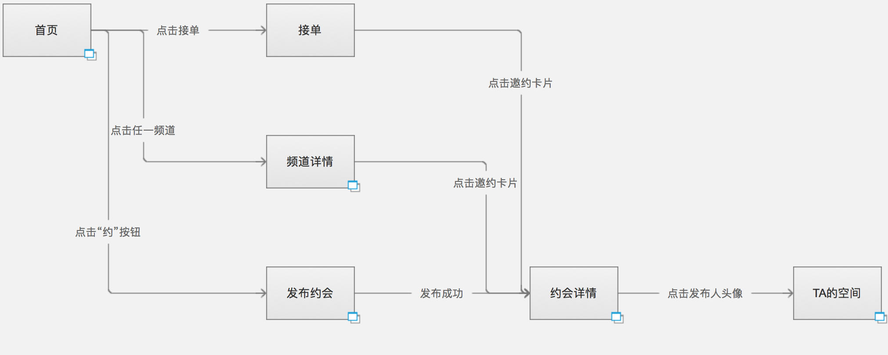
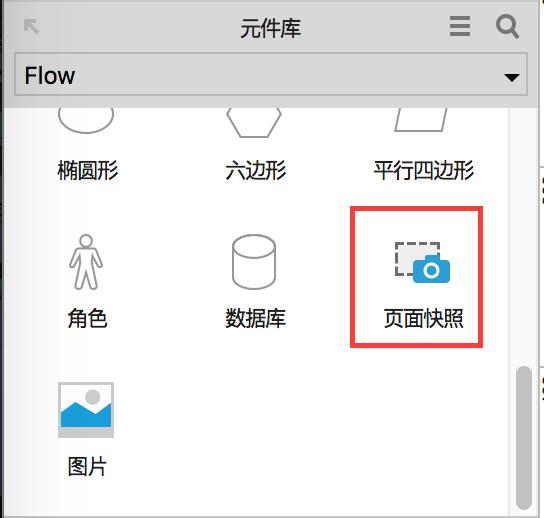
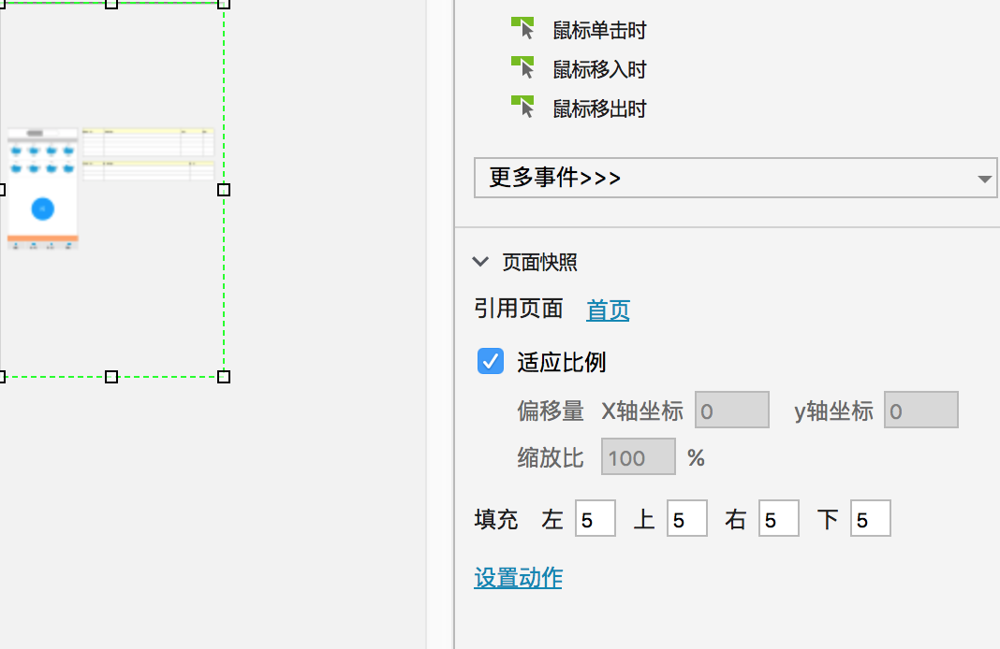
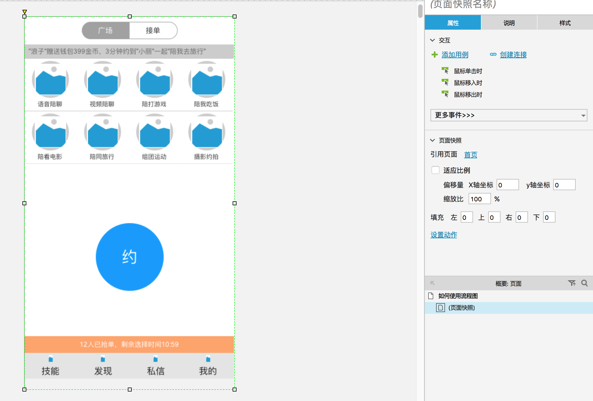
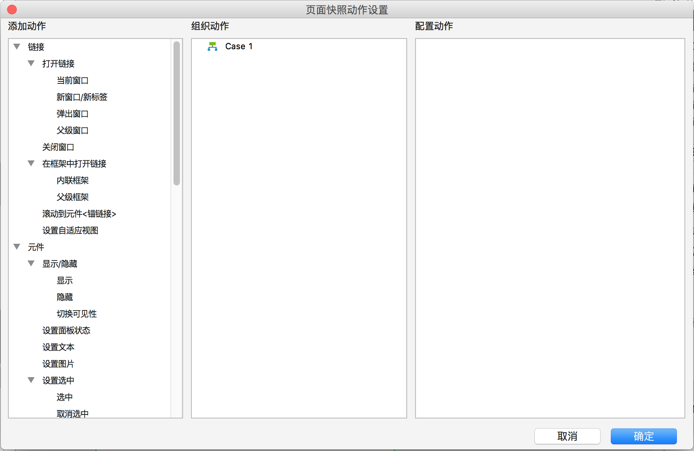
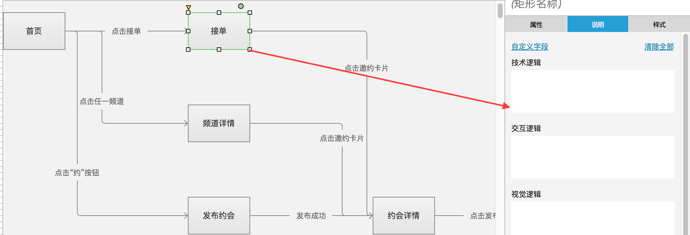

# axure-1 Axure原型设计：Axure原型加流程图功能的高效结合

> 大部分PM使用Visio或者Mindmanager来画流程图然后倒入Axure，而很少有人知道Axure自带的流程图功能也很实用。尤其是和原型搭配使用，绝对是双剑合璧，天下无敌。

希望通我使用“原型+流程图”的多年经验，让更多的PM也可以掌握并运用到平常的原型设计工作中。

## 一、流程图的通病

**目前所有流程图软件都存在一个问题，那就是流程图无法关联到原型页面。**

无法做到直接点击流程图里面的节点(页面、功能、操作)，展示与之相关的更多信息。这样子使用上面会很受限。

**页面流程图无法查看指定页面详情**

比如我们画页面流程图，展示了所有页面以及页面间的流向关系。UI设计师和开发童鞋，有时候需要查看某个页面的具体内容。

**功能流程图无法查看指定功能详情**

功能流程图也存在类似的问题，开发童鞋想了解某个功能的具体情况，只能问PM或者自己找对应功能的原型页面。

**功能逻辑图无法显示具体控件**
画一个功能具体的步骤逻辑的时候，有时候我们需要展示一下其中的控件，比如写下单流程的时候可能需要展示一下付款弹窗。

当然也可以使用原始方法，直接复制过来，第一麻烦第二修改了无法同步。

**无法对流程图节点做注释**
流程图是由一个个节点连接而成，有时候节点需要写几句话注释一下。不是所有的流程图软件都能支持，更主要的是没办法做到默认隐藏，点击展开注释。除非你把流程导出为html格式，但是这样子又不能导入到Axure中了。

## 二、Axure流程图的介绍

**以上这些使用问题，都可以使用Axure的流程图来满足。接下来我会一一的来讲解如何解决。**

先简单介绍一下Axure的流程图功能是什么，其实本质上是一个元件库。

含有很多种元件，用途各不相同。大家使用的时候尽量遵循其定义的通用规范。当然如果你有特殊需要，可以单独定义。

## 三、流程图如何关联页面

Axure提供了两种操作方法，本质上都是设置“引用页面”属性，Flow元件库中的所有元件都具备该属性。Dafault默认元件库中部分元件支持该属性。

“引用页面”除了关联了对应页面，同时集成了对应页面的标题。当你修改页面结构中的页面标题，这里也会同步更新。

### 拖拽页面到工作区

当你画页面流程图的时候，需要展示某个页面的详情。

那么选中Axure左方的页面结构中的该页面。

然后拖动到右边的工作区即可，效果如下图。

最终的显示效果请查看我之前的文章，以及我绘画的页面原型图。

其中右下角带有“蓝色矩形组”图标的矩形，代表可以点击进入该页面的线框图，查看详细的页面布局、控件、逻辑等。

### 设置引用页面属性

根据上图，你应该可以猜到其实拖曳页面名称到工作区，是创建了一个页面并且设置了属性“引用页面”到该页面。所以你也可以这样做。

- 拖动Flow元件库中的元件到工作区
- 设置属性“引用页面”到你所需的页面
- 生成原型查看效果。

## 四、流程图如何关联具体功能

方法有2种，大家可以按需参考。

设置“引用页面”属性到具体的功能页面，方法如上。
设置单击链接到具体的功能页面，再简单不过。

## 五、流程图如何显示具体控件

在画某个功能的具体逻辑时候，我们可以借助Axure的“页面快照”功能来展示一些控件。有助于技术童鞋对功能的理解和实现。

### 新建页面快照

从左方的Flow元件库，拖动”页面快照”到右方的工作区。

### 设置引用页面

方法和上面的类似，但是展示效果有点区别哦。所谓页面快照是指将引用页面的具体内容显示到该元件区域范围里。比如我引用了闪电约首页这个页面，那么效果如下。

### 修改快照参数

显示明显有问题，我们可以修改一下参数。

取消适应比例，然后把该页面快照元件的尺寸修改成375 x667，然后填充的相对坐标改成(0,0,0,0)。此时快照效果如下。

### 配置动作

比如你可以设置该页面隐藏一些控件，或者展示隐藏的弹框，吐司提示。

大概是这样子了，在设计商品详情、购物车、确认订单的时候，该功能特别适用。有需要的童鞋可以试下。

## 七、流程图如何显示节点的注释

这个其实很简单，但是很多PM没用过。

具体的可以查看我写过的旧文《产品逻辑的常用表达法》，《Axure最正统的产品逻辑表达法》。

## 八、总结

以上这些技巧都是Axure自带的流程图功能，只是很少有人系统的总结并分享出来。

希望通过我的文章，大家以后能善用Axure的流程图。而不是盲目的跟风使用第三方脑图软件。

适合产品经理的流程图软件就是Axure，配合强大的原型功能。绝对是双剑合璧，天下无敌。