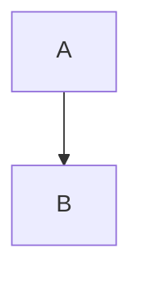

#### 一、使用cookie-parser和express-session来处理cookie 和session

```javascript
//引入
const cookieParser = requiree('cookie-parser');
const session = require('express-session');
//使用
app.use(cookieParser('swq')); //swq是自定义字符串，用来对cookie进行签名，提高安全性。
app.use(session({
	secret: 'swq',
	resave: false,
	saveUninitialized: true
}))
```

#### 二、登陆成功之后，将用户 id 生成cookie

 home.js

```javascript
home.login = (req, res, next) => {
	 let data = req.body;
	 if(data.username == '') {
        return res.send({resultCode: 400, resultMsg: '用户名为空'});
    } else if(data.password == '') {
        return res.send({resultCode: 400, resultMsg: '密码为空'});
    } else {
        User.findOne({name: data.name}).then(user => {
            if(!user) {
                return res.send({resultCode: 400, resultMsg: '用户不存在'});
            }
            if(data.password != user.password) {
                return res.send({resultCode: 400, resultMsg: '密码错误'});
            }
            //生成cookie
            auth.gen_session(user, res);
            return res.send({resultCode: 200, resultMsg: '登录成功'});
        })
    }
}
```

auth.js

```
// 生成cookie
auth = {
  gen_session: (user, res) => {
      let auth_user = `${user._id}`;
      res.cookie('suweiqing', auth_user, {
          path: '/',
          signed: true,//对cookie密码进行加密的话, 需要使用到cookieParser
          httpOnly: true,
          maxAge: 30 * 24 * 60 * 60 * 1000
      });
  }
}
```

#### 三、编写中间件，判断用户是否登陆(判断session中是否有用户信息)

```
// 通过cookie去生成session的方法
app.use(auth.authUse);
```

auth.js

```javascript
auth = {
	authUser: (req, res, next) => {
    //中间件, 所有的请求都要经过它, 我们在这来判断用户的登录情况
    if(req.session.user) {
        next();//用户已经登录情况下, 直接下一步
    }
    else {
        //需要通过cookie去生成session
        //1.获取cookie
        let auth_token = req.signedCookies['suweiqing'];//cookie-parser直接帮我解密了
        if (!auth_token) {
            next();//用户没有cookie的情况
    }
        else {
            //2.通过cookie生成session
            let user_id = auth_token;
            //数据库去找这个用户ID
            User.findOne({_id: user_id}, (err, user) => {
                if (err) {
                    return res.end(err);
                }
                else {
                    if (!user) {
                        next();
                    }
                    else {
                        //3.结束
                        req.session.user = user;
                        next();
                    }
                }
            })
        }
    }
	}
}
```


```flow

```





#### 四、设置已登陆用户和未登陆用户的权限

1. 已登陆用户不能访问未登陆用户页面

auth.js

```javascript
auth = {
   //判断用户未登录的中间件
    userRequired: (req, res, next) => {
        if(!req.session || !req.session.user || !req.session.user._id) {
            return res.redirect('/login');
        }
        next();
    }
}
```


2. 未登陆不能访问已登陆界面

auth.js

```javascript
auth = {
		//判断用户已登录的中间件
    userNotRequired: (req, res, next) => {
        if(req.session.user != undefined) {
            return res.redirect('back');
        }
        next();
    }
}
```

3. 使用权限中间件

```javascript
router.get('/', auth.userRequired,home.index);
router.get('/login', auth.userNotRequired, home.loginPage)
```

