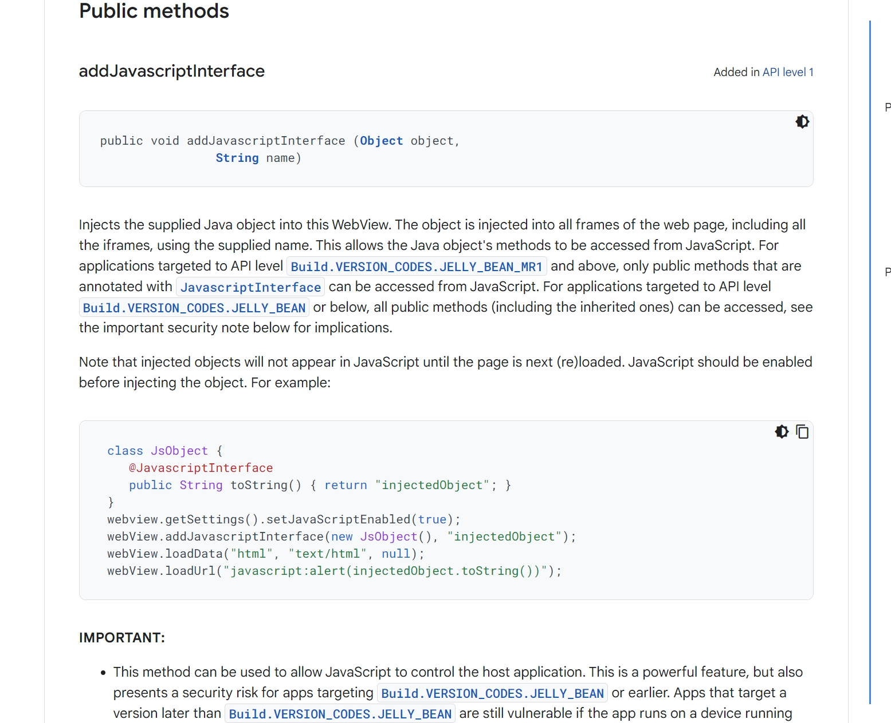

> 在  H5 开发中，除了单纯的 H5 页面开发，还有很大一部分是在原生应用中开发 H5，这就是 Hybrid  开发，我们有必要学习他和普通的 H5 开发的不同。

## WebView 简单介绍
WebView 组件是一种在应用程序中嵌入网页内容的组件，广泛应用于移动应用和桌面应用中。WebView 是一个显示网页内容的组件，它可以加载 HTML、CSS 和 JavaScript等网页资源，使得应用程序能够展示和交互网页内容。
它的应用场景有，混合应用开发，结合原生应用和网页应用的元素，加载本地或者远程的网页资源，支持前进、后退等导航操作，允许应用程序与网页中的 JavaScript 代码进行交互。内容展示，用于展示新闻、文章、视频等内容，支持加载图片、视频等多媒体资源，可以设置安全策略，限制网页访问本地资源或执行某些操作。
在 Android 平台，Android SDK 提供了 WebView 类，iOS SDK 提供了 WKWebView 类，用于在 iOS 应用中嵌入网页，桌面如 Electron 应用中也可以使用 WebView 组件。

混合开发还有哪些需要注意的：
- 安全性：
	- 由于 WebView 可以加载任意网页，因此需要特别注意安全性。常见的安全措施包括：
		- 限制网页访问本地文件系统。
		- 禁用或限制 JavaScript 的某些功能。
		- 使用 HTTPS 加载网页资源，避免中间人攻击。
- 性能优化：
	- 由于 WebView 组件会占用较多的系统资源，因此在开发中需要注意性能优化。常见的优化措施包括：
		- 减少网页资源的加载量。
		- 优化网页的渲染性能。
		- 使用缓存机制减少重复加载。

## 通信的必要性&常见场景
1. H5 页面调用原生设备功能：由于浏览器环境的限制，H5页面无法直接访问很多原生设备的功能，如摄像头、文件系统、GPS、蓝牙、NFC等。
2. 用户行为的响应和处理：考虑到用户体验的一致性以及性能优化等，H5页面中的用户行为（比如点击、滑动复杂计算等操作可能需要APP进行处理。）
3. 数据交换：在一些复杂的应用场景下，H5页面和APP可能需要共享数据。例如，用户在APP中登录后，H5页面可能需要获取用户的登录信息。或者用户在H5页面中进行了一些操作（比如修改了设置），这些操作的结果可能需要同步到APP中。
4. 页面跳转：H5页面可能需要触发APP内的页面跳转。
5. 事件通知：H5页面可能需要向APP报告一些时间，例如页面加载完成，数据加载错误等。这些事件通常是通过JavaScript Bridge通知给APP的。

## 通信的方式
1. **JavaScript Bridge**: JavaScript Bridge 是一种可以让 JavaScript 在原生应用中运行的方法。这是最常见的方式，因为它允许H5和原生应用之间互相通信。
在原生应用内部封装一个WebView组件，然后在WebView内部进行H5代码。在JavaScript与原生之间构建一个桥梁，使得JavaScript可以调用原生的API接口，反之亦然。
2. **URL Schema**: URL Schema 是一种特殊的 URL，可以用来启动应用、切换到应用或在应用中执行特定的操作。URL Schema 可以通过H5的超链接或者JavaScript的window.location方式进行调用。
	使用场景：
		- 跨应用通信（比如在浏览器中打开APP)、（打开地图等）
		- 深度链接：URL Schema 也可以被用于创建深度链接，也就是直接打开应用并导航到指定页面。
## JS Bridge 实现
一句话小结：
- H5 给原生发信息：通过原生在 WebView组件上（window对象）上注入全局方法，给H5调用来让H5调用原生特定功能。
- 原生给H5发信息：H5通过在window对象上定义特定方法，让原生应用可以通过WebView的接口evaluateJavaScript（或相似的）方法直接调用这些函数。


### Android如何构建桥方法：
在安卓系统中个，可以通过 WebView 的 [addJavascriptInterface](https://developer.android.google.cn/reference/android/webkit/WebView#addJavascriptInterface(java.lang.Object,%20java.lang.String)) 方法来创建JavaScript与原生代码的桥接。此方法使原生应用可以直接在 JavaScript 中调用。
``` Java
public class WebAppInterface {
	Context mContext;

	WebAppInterface(Context c) {
		mContext = c;
	}

	@JavaScriptInterface
	public void showMessage(String message) {
		Toast.makeText(mContext, message, Toast.LENGTH_SHORT).show();
	}
}

WebView webview = (WebView) findViewById(R.id.webview);
webView.addJavaScriptInterface(new WebAppInterface(this), "Android");
```
上述代码中，我们定义了一个名为 WebAppInterface 的类，并在其中创建一个名为 showMessage 的方法。然后，我们通过 addJavascriptInterface 方法将这个类的实例与名为"Android"的JavaScript对象关联。JavaScript可以通过 window.Android.showMessage 调用该方法，实现原生 Toast 消息的展示。



### iOS如何构建桥方法：
在iOS系统中，我们通常使用WKWebView的WKUserContentController和WKScriptMessageHandler协议来创建与JavaScript的桥接。
``` swift
let contentController = WKUserContentController()
contentController.add(self, name: "ios")

let config = WKWebViewConfiguration()
config.userContentController = contentController

let webView = WKWebView(frame: .zero, configuration: config)


extension ViewController: WKScriptMessageHandler {
	func userContentController(_ userContentController: WKUserContentController, didReceive message: WKScriptMessage) {
		if message.name === "ios", let messageBody = message.body as? String {
			let alert = UIAlertController(title: nil, message: messageBody, preferredStyle: .alert)
			alert.addAction(UIAlertAction(title: "OK", style: .default, handler: nil))
			self.present(alert, animated: true, completion: nil)	
		}
	}
}

```
在这个例子中，我们首先创建了一个 WKUserContentController 对象，并通过 add 方法注册了一个名为 "ios" 的脚本消息处理程序。然后，我们在 didReceive 方法中处理从 JavaScript 接收到的消息，并通过一个弹出警告框显示。遮掩个，当 JavaScript 调用名为 "ios"的方法时，iOS端会以弹窗的形式显示接收到的消息，从而实现了与安卓同样的功能。

### 在H5场景下，JS如何调用桥方法给原生发信息
在H5页面中，你可以直接用前面我们创建的桥接方法来给原生应用发送消息。例如：
对于安卓：
``` JavaScript
window.Android.showMessage("Hello, Android!");
```
对于 iOS:
``` javascript
window.webkit.messageHandlers.ios.postMessage("Hell, iOS!");
```
## 原生如何通过桥给H5发信息：
原生应用可以通过WebView的evaluateJavaScript 方法（对于安卓）或evaluateJavaScript(对于iOS)来执行JavaScript代码，从而给H5发消息。例如：
对于安卓：
```java
webView.evaluateJavaScript("javascript: showMessage('Hello, Web!')", null);
```
对于iOS:
```swift
webView.evaluateJavaScript("showMessage('Hello, Web!')", completionHandler: nil);
```
在这些例子中，showMessage 是H5页面中的一个JavaScript函数，原生应用通过执行这个函数来给H5发送消息。
## Q&A
1. h5 调用 iOS 方法的命令为什么比安卓复杂？（window.webkit.messageHandlers.ios.postMessage）
安全性是主要的考虑因素。
- 在Android 中，使用 addJavascriptInterface 方法可以直接将 Java 对象暴露给 JavaScript，这样可能会导致安全问题，因为 JavaScript 可能会访问并执行 Java 对象的任何公共方法。尽管可以通过 @JavascriptInterface 注解来限制哪些方法可以被 JavaScript 调用，但是这种方式仍然需要开发者在编写代码时格外小心。
- iOS 的 window.webkit.messageHandlers.ios.postMessage 方法只允许 JavaScript 向原生代码发送字符串消息，这种方式更安全，因为原生代码可以完全控制如何处理这些消息。
灵活性也是一个考虑因素。
- 在 Android 中，需要为每一个要暴露给 JavaScript 的方法创建一个单独的 Java 方法。
- iOS 的 window.webkit.messageHandlers.ios.postMessage 方法可以接收任何类型的 JavaScript 消息，然后在原生代码中根据消息的内容来决定如何处理。
## H5封装一个通用的JSBridge库的示例

我们在H5中去调用桥方法的时候，可以考虑抽取通用的桥方法库，让桥的调用像调用普通js方法一样简单，这里提供一个简单示例。（实际的实现结合具体的桥协议、业务场景会更加复杂）。
### 通用特性考虑：
1. 环境检测：需要对运行环境进行检测，判断当前是在 Android、iOS还是其他环境下，这样可以根据不同环境调用不同的接口。
2. 接口封装：将原生提供的接口封装成JavaScript函数，使其可以直接被JavaScript调用。这些函数可能包含调用设备功能（如获取设备信息、访问相机、地理位置等）、与原生应用交互（如发送事件、接收事件等）等功能。
3. 错误处理：在封装的接口中添加错误处理，确保当调用失败时可以提供明确的错误信息。
4. 事件系统：提供事件监听和触发的功能，使得JavaScript可以监听和触发原生应用的事件。
下面是一个简化的JSBridge库设计示例：

```js
	const JSBridge = (function () {

        // check if JSBridge has already been created

        if (window?.JSBridge) {

          return window.JSBridge;

        }

  

        const isAndroid = window.android ? true : false;

        const isiOS = window.webkit ? true : false;

        const callbackMap = new Map();

        const eventListeners = new Map();

        let callbackCounter = 0;

  

        // Call a native method and return a promise

        function callNative(method, params) {

          return new Promise((resolve, reject) => {

            const callbackId = 'cb_' + callbackCounter++;

            callbackMap.set(callbackId, {resolve, reject});

  

            // 具体的messages设计要看桥方法的协议

            let message = {

              method,

              params,

              callbackId

            };

  

            try {

              if(isAndroid) {

                window.android.call(JSON.stringify(message));

              } else if(isiOS) {

                window.webkit.messageHandlers.call.postMessage(message);

              } else {

                throw new Error("Unsupported environment")

              }

            } catch (error) {

              reject(error)

            }

          })

        }

  

        // Called by native code

        function onNativeCallback(callbackId, result, error) {

          const callback = callbackMap.get(callbackId);

          if(callback) {

            if(error) {

              callback.reject(error)

            } else {

              callback.resolve(result)

            }

            callbackMap.delete(callbackId);

          }

        }

  

        // Called by Native code

        function onNativeEvent(eventName, ...args) {

          const listeners = eventListeners.get(eventName);

          if(listeners) {

            listeners.forEach(listener => listener(... args));

          }

        }

  

        // Add an event listener

        function addEventListener(eventName, listener) {

          let listeners = eventListeners.get(eventName);

          if(!listeners) {

            listeners = new Set();

            eventListeners.set(eventName, listeners)

          }

          listeners.add(listener);

        }

  

        // Remove an event listener

        function removeEventListener(eventName, listener) {

          const listeners = eventListeners.get(eventName);

          if(listeners) {

            listeners.delete(listener);

          }

        }

  

        // Expose to global scope for native code to call

        window.onNativeCallback = onNativeCallback;

        window.onNativeEvent = onNativeEvent;

  

        // The public API

        return {

          callNative,

          addEventListener,

          removeEventListener

        };

      })();
```

使用者可以像这样使用这个库：
```javascript
async function getDeviceId() {
	try {
		const deviceId = await JSBridge.callNative('getDeviceId');
		console.log(deviceId);
	} catch (error) {
		console.log('Failed to get device id', error)
	}
}

getDeviceId();
```

