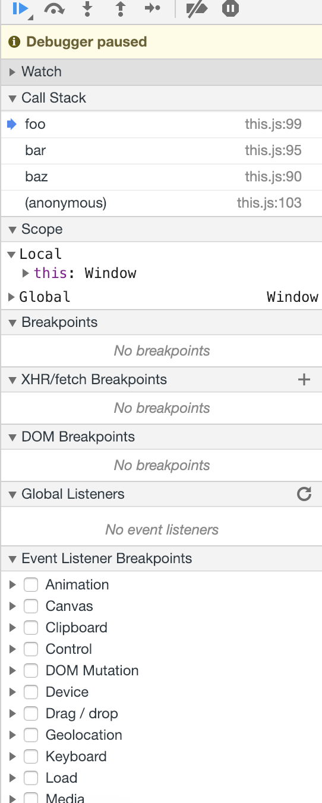
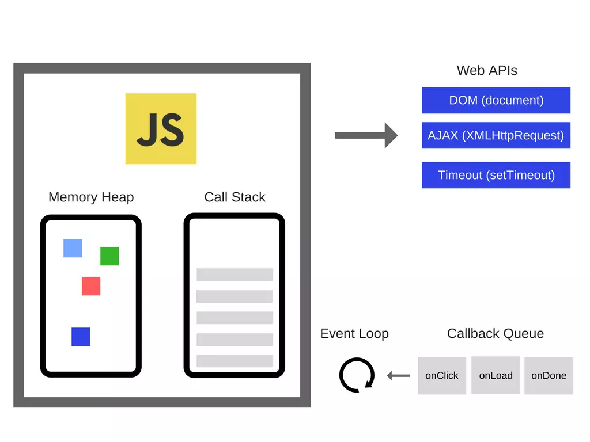
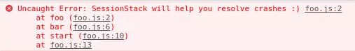

# js基础-1 调用堆栈

调用栈是**解释器**（就像浏览器中的javascript解释器）追踪函数执行流的一种机制。当执行环境中调用了多个函数时，通过这种机制，我们能够追踪到哪个函数正在执行，执行的函数体中又调用了哪个函数。

- 每调用一个函数，解释器就会把该函数添加进调用栈并开始执行。
- 正在调用栈中执行的函数还调用了其它函数，那么新函数也将会被添加进调用栈，一旦这个函数被调用，便会立即执行。
- 当前函数执行完毕后，解释器将其清出调用栈，继续执行当前执行环境下的剩余的代码。
- 当分配的调用栈空间被占满时，会引发“堆栈溢出”。

```js
function greeting() {
   // [1] Some codes here
   sayHi();
   // [2] Some codes here
}
function sayHi() {
   return "Hi!";
}

// 调用 `greeting` 函数
greeting();

// [3] Some codes here
```

上面的代码将这样执行:

1. 忽略前面所有函数，直到greeting()函数被调用。
2. 把greeting()添加进调用栈列表。
3. 执行greeting()函数体中的所有代码。

> 调用栈列表:
>  
> -greeting

4. 代码执行到sayHi()时，该函数被调用。
5. 把sayHi()添加进调用栈列表。
6. 执行sayHi()函数体中的代码，直到全部执行完毕。
>调用栈列表:
>
> -greeting
>
> -sayHi

7. 返回来继续执行greeting()函数体中sayHi()后面的代码。
8. 删除调用栈列表中的sayHi()函数。
9. 当greeting()函数体中的代码全部执行完毕，返回到调用greeting()的代码行，继续执行剩余JS代码。

> 调用栈列表:
>
> -greeting

10. 删除调用栈列表中的greeting()函数。

一开始，我们得到一个空空如也的调用栈。随后，每当有函数被调用都会自动地添加进调用栈，执行完函数体中的代码后，调用栈又会自动地移除这个函数。最后，我们又得到了一个空空如也的调用栈。

再来看个例子：

```js
function baz() {
    console.log('baz');
    bar();
}

function bar() {
    console.log('bar');
    foo();
}

function foo() {
    debugger;
    console.log('foo');
}

baz();
```

浏览器中的调用堆栈截图：



---

## JavaScript底层是怎么运作的

### Javascript引擎

JavaScript 引擎说起来最流行的当然是谷歌的 V8 引擎了， V8 引擎使用在 Chrome 以及 Node 中，下面有个简单的图能说明他们的关系：


这个引擎主要由两部分组成:

- 内存堆：这是内存分配发生的地方
- 调用栈：这是你的代码执行时的地方

### 运行时

  有些浏览器的 API 经常被使用到(比如说：setTimeout)，但是，这些 API 却不是引擎提供的。那么，他们是从哪儿来的呢？事实上这里面实际情况有点复杂。



很多引擎之外的api，我们把这些称为浏览器提供的 Web API，比如说 DOM、AJAX、setTimeout等等。

然后我们还拥有如此流行的事件循环和回调队列。

### 调用栈

JavaScript 是一门单线程的语言，这意味着它只有一个调用栈，因此，它同一时间只能做一件事。
  调用栈是一种数据结构，它记录了我们在程序中的位置。如果我们运行到一个函数，它就会将其放置到栈顶。当从这个函数返回的时候，就会将这个函数从栈顶弹出，这就是调用栈做的事情。
  让我们来看一看下面的例子：

```js
 function multiply(x, y) {
      return x * y;
    }
    function printSquare(x) {
      var s = multiply(x, x);
      console.log(s);
    }
    printSquare(5);

```

当程序开始执行的时候，调用栈是空的，然后，步骤如下：


每一个进入调用栈的都称为__调用帧__。

  这能清楚的知道当异常发生的时候堆栈追踪是怎么被构造的，堆栈的状态是如何的。让我们看一下下面的代码：

```js
function foo() {
      throw new Error('SessionStack will help you resolve crashes :)');
    }
    function bar() {
      foo();
    }
    function start() {
      bar();
    }
    start();

```

如果这发生在 Chrome 里(假设这段代码实在一个名为 foo.js 的文件中)，那么将会生成以下的堆栈追踪：



"堆栈溢出"，当你达到调用栈最大的大小的时候就会发生这种情况，而且这相当容易发生，特别是在你写递归的时候却没有全方位的测试它。我们来看看下面的代码：

```js
    function foo() {
      foo();
    }
    foo();
```

当我们的引擎开始执行这段代码的时候，它从 foo 函数开始。然后这是个递归的函数，并且在没有任何的终止条件的情况下开始调用自己。因此，每执行一步，就会把这个相同的函数一次又一次地添加到调用堆栈中。然后它看起来就像是这样的：


### 并发与事件循环

由于javascript是单线程运行，只有一个调用堆栈，当某个函数占用大量的时间时，浏览器就不能做任何其他事情，它会被堵塞。这意味着浏览器不能渲染，不能运行其他的代码，它被卡住了。如果你想在应用里让 UI 很流畅的话，这就会产生问题。如何在不阻塞 UI 的情况下执行复杂的代码，让浏览器不会不响应?解决方案就是异步回调。

### 再说回Javascript引擎

Google V8 引擎使用 C++ 代码编写，实现了 ECMAScript 规范的第五版，可以运行在所有的主流操作系统中，甚至可以运行在移动终端 ( 基于 ARM 的处理器，如 HTC G7 等 )。V8 最早被开发用以嵌入到 Google 的开源浏览器 Chrome 中，但是 V8 是一个可以独立的模块，完全可以嵌入您自己的应用，著名的 Node.js( 一个异步的服务器框架，可以在服务端使用 JavaScript 写出高效的网络服务器 ) 就是基于 V8 引擎的。

和其他 JavaScript 引擎一样，V8 会编译 / 执行 JavaScript 代码，管理内存，负责垃圾回收，与宿主语言的交互等。V8 的垃圾回收器采用了众多技术，使得其运行效率大大提高。通过暴露宿主对象 ( 变量，函数等 ) 到 JavaScript，JavaScript 可以访问宿主环境中的对象，并在脚本中完成对宿主对象的操作。

### 克服单线程编程的缺点 —————异步回调


