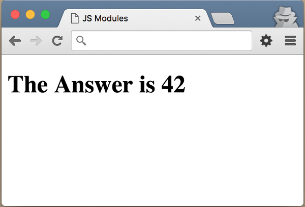
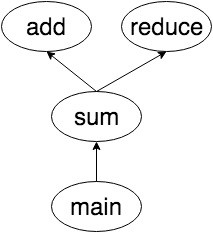
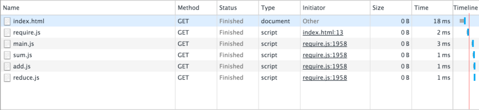
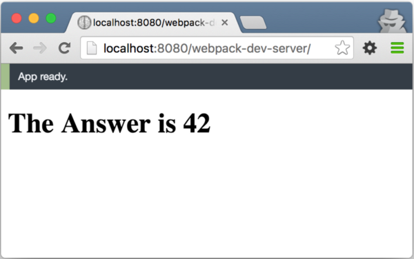

---
2020.8.9
---

你是否是 JavaScript 新手？并且对模块，模块加载器和模块打包器感到困惑吗？或者你已经编写了一段时间的 JavaScript ，但是没法掌握模块的一些术语？你是否听过 CommonJS、AMD、Browserify、SystemJS、Webpack、JSPM 等等术语，但是不理解我们为什么需要它们？

我会试着解释他们是什么，他们试图解决什么问题，以及他们如何解决这个问题。

示例应用程序


(该图为应用程序运行界面)

在这篇文章中，我将使用一个简单的 web 应用程序来演示模块的概念。应用程序在浏览器中显示数组的和。该应用程序由4个函数和一个 index.html文件组成。

(该图为函数的依赖示意图)

main 函数计算数组中数字的和，然后把答案显示在 span#answer 中。sum 函数依赖于两个函数：add 和 reduce。add 函数做它名字所做的操作；把两个数相加。reduce 函数遍历数组，并且调用 iteratee 回调函数。

花点时间理解下面的代码。我将会重复多次使用相同的函数。

HTML 代码:

``` html
<!DOCTYPE html>
<html>
  <head>
    <meta charset="UTF-8">
    <title>JS Modules</title>
  </head>
  <body>
    <h1>
      The Answer is
      <span id="answer"></span>
    </h1>
  </body>
</html>
```
JavaScript 代码:

```Javascript
// 1-main.js 
var values = [ 1, 2, 4, 5, 6, 7, 8, 9 ];
var answer = sum(values)
document.getElementById("answer").innerHTML = answer;
```
JavaScript 代码:

```Javascript
// 2-sum.js 
function sum(arr){
  return reduce(arr, add);
}
```

JavaScript 代码:

```Javascript

// 3-add.js 
function add(a, b) {
  return a + b;
}
```
JavaScript 代码:

```Javascript
// 4-reduce.js 
function reduce(arr, iteratee) {
  var index = 0,
    length = arr.length,
    memo = arr[index];
  for(index += 1; index < length; index += 1){
    memo = iteratee(memo, arr[index])
  }
  return memo;
}
```
我们来看看如何把这些代码片段整合在一起，来构建一个应用程序。

### 使用内嵌脚本
内嵌脚本就是在 <script></script> 标记之间添加 JavaScript 代码。这是我开始学 JavaScript 时的做法。我相信大多数 JavaScript 开发者在其生命中至少做过一次这样的事情。

这是一个很好的入门办法。没有外部文件或依赖关系需要担心。但是这也导致了不可维护的代码，因为：

缺乏代码可重用性：如果需要添加另一个页面，需要从这个页面中获得一些函数，我们就不得不复制粘贴代码。
缺乏依赖解析：你必须保证 main 函数之前已经添加了 add、reduce 和 sum 函数。
全局命名空间污染：所有的函数和变量将都将驻留在全局作用域中。

HTML 代码:

```Html
<!-- index.html -->
<!DOCTYPE html>
<html>
  <head>
    <meta charset="UTF-8">
    <title>JS Modules</title>
  </head>
  <body>
    <h1>
      The Answer is
      <span id="answer"></span>
    </h1>
 
    <script type="text/javascript">
      function add(a, b) {
        return a + b;
      }
      function reduce(arr, iteratee) {
        var index = 0,
          length = arr.length,
          memo = arr[index];
        for(index += 1; index < length; index += 1){
          memo = iteratee(memo, arr[index])
        }
        return memo;
      }
      function sum(arr){
        return reduce(arr, add);
      }
      /* Main Function */
      var values = [ 1, 2, 4, 5, 6, 7, 8, 9 ];
      var answer = sum(values)
      document.getElementById("answer").innerHTML = answer;
    </script>
  </body>
</html>
```
### Script 标签引入 JavaScript 文件

这是从嵌入脚本的一个自然过渡。现在我们将大段的 JavaScript 分成更小的代码片段，并用 <script src=“...”> 标签加载它们。

通过将文件分成多个 JavaScript 文件，我们可以重用这些代码。我们不再需要在不同的 html 页面之间复制和粘贴代码。我们只需要将该文件用 script 标签加载就可以了。尽管这是更好的方法，但仍然有以下问题：

- 缺乏依赖解析：文件的顺序很重要。你必须保证在加载 main.js 文件之前已经加载了 add.js、reduce.js 和 sum.js 文件。
- 全局命令空间污染：所有的函数和变量依然在全局作用域中。

HTML 代码:

```Html
<!-- 0-index.html -->
<!DOCTYPE html>
<html>
  <head>
    <meta charset="UTF-8">
    <title>JS Modules</title>
  </head>
  <body>
    <h1>
      The Answer is
      <span id="answer"></span>
    </h1>
 
    <script type="text/javascript" src="./add.js"></script>
    <script type="text/javascript" src="./reduce.js"></script>
    <script type="text/javascript" src="./sum.js"></script>
    <script type="text/javascript" src="./main.js"></script>
  </body>
</html>
```

JavaScript 代码:

```Javascript
//add.js
function add(a, b) {  return a + b;}
```
JavaScript 代码:

```Javascript
//reduce.js
function reduce(arr, iteratee) {
  var index = 0,
    length = arr.length,
    memo = arr[index];
 
  index += 1;
  for(; index < length; index += 1){
    memo = iteratee(memo, arr[index])
  }
  return memo;
}
```
JavaScript 代码:

```Javascript
//sum.js
function sum(arr){
  return reduce(arr, add);
}
```

JavaScript 代码:

```Javascript
// main.js
var values = [ 1, 2, 4, 5, 6, 7, 8, 9 ];
var answer = sum(values)
document.getElementById("answer").innerHTML = answer;
```

### 模块对象和 IIFE(模块模式)

通过使用模块对象和 立即调用的函数表达式(IIFE) ，我们可以减少对全局作用域的污染。在这种方法中，我们只向全局作用域公开一个对象。该对象包含了我们在应用程序中需要的所有方法和值。在本例中，我们只向全局作用域公开了 myApp 对象。所有的函数都将被保存在 myApp 对象中。

JavaScript 代码:

```Javascript
// 01-my-app.js 
var myApp = {};
```
JavaScript 代码:

```Javascript
// 02-add.js
(function(){
  myApp.add = function(a, b) {
    return a + b;
  }  
})();
```

JavaScript 代码:

```Javascript
// 03-reduce.js 
(function(){
  myApp.reduce = function(arr, iteratee) {
    var index = 0,
      length = arr.length,
      memo = arr[index];
  
    index += 1;
    for(; index < length; index += 1){
      memo = iteratee(memo, arr[index])
    }
    return memo;
  }  
})();
```

JavaScript 代码:

```Javascript
// 04-sum.js
(function(){
  myApp.sum = function(arr){
    return myApp.reduce(arr, myUtil.add);
  }  
})();
```
JavaScript 代码:

```Javascript
// 05-main.js
(function(app){
  var values = [ 1, 2, 4, 5, 6, 7, 8, 9 ];
  var answer = app.sum(values)
  document.getElementById("answer").innerHTML = answer;
})(myApp);
```

HTML 代码:

```Html
<!-- 06-index.html -->
<!DOCTYPE html>
<html>
  <head>
    <meta charset="UTF-8">
    <title>JS Modules</title>
  </head>
  <body>
    <h1>
      The Answer is
      <span id="answer"></span>
    </h1>
 
    <script type="text/javascript" src="./my-app.js"></script>
    <script type="text/javascript" src="./add.js"></script>
    <script type="text/javascript" src="./reduce.js"></script>
    <script type="text/javascript" src="./sum.js"></script>
    <script type="text/javascript" src="./main.js"></script>
  </body>
</html>
```
请注意，除了 my-app.js 之外，其它每个文件都被封装成了 IIFE 格式。

JavaScript 代码:

```Javascript
// 立即调用的函数表达式(IIFE) 格式
(function(){ /*... your code goes here ...*/ })();
```

通过将每个文件封装到 IIFE 中，所有的本地变量都保留在函数作用域内。因此，函数中的所有变量都将保持在函数作用域内，而不会污染全局作用域。

我们通过将它们附加到myApp对象来公开添加、减少和sum函数。我们通过引用myApp对象来访问这些函数

我们通过将 add、reduce 和 sum 函数附加在 myApp 对象上，从而对外公开它们。我们通过引用 myApp 对象来访问这些函数：

JavaScript 代码:

```Javascript
myApp.add(1,2);
myApp.sum([1,2,3,4]);
myApp.reduce(add, value);
```
我们还可以通过 IIFE 的参数，传递 myApp 全局对象，就像 main.js 文件中所示一样。通过将该对象作为参数传递给 IIFE ，我们就可以为该对象选择一个较短的别名。而我们的代码会更简洁一些。

JavaScript 代码:

```Javascript
(function(obj){
  // obj is new veryLongNameOfGlobalObject
})(veryLongNameOfGloablObject);
```

与前面的例子相比，IIFE 是一个巨大的改进。大多数流行的 JavaScript 库，如 jQuery ，都使用这种模式。它公开了一个全局对象 $，所有的函数都在 $ 对象中。

然而，这并不能算是一个完美的解决方案。这种方法仍然面临与上一节相同的问题。

- 缺乏依赖解析：文件的顺序依然重要，myApp.js 必须出现在所有其它文件之前加载，main.js 必须处在所有其它库文件之后。
- 全局命令空间污染：现在全局变量的数量变成了 1，但是还不是 0 。

### CommonJS

2009年，有人讨论将 JavaScript 引入服务器端。因此 ServerJS 诞生了。随后，ServerJS 将其名称改为 CommonJS 。

CommonJS 不是一个 JavaScript 库。它是一个标准化组织。它就像 ECMA 或 W3C 一样。ECMA 定义了 JavaScript 的语言规范。W3C定义了 JavaScript web API ，比如 DOM 或 DOM 事件。 CommonJS 的目标是为 web 服务器、桌面和命令行应用程序定义一套通用的 API 。

CommonJS 还定义了模块 API 。因为在服务器应用程序中没有 HTML 页面和 </script><script> 标签，所以为模块提供一些清晰的 API 是很有意义的。模块需要被公开(**export**)以供其它模块使用，并且可以访问(**import**)。它的导出模块语法如下：

JavaScript 代码:

```Javascript
// add.js
module.exports = function add(a, b){  
  return a+b;
}
```

上述代码定义和输出了一个模块。代码保存在 add.js 文件中。

要使用或导入 add 模块，您需要 require 函数，使用文件名或模块名作为参数。下面的语法描述了如何将一个模块导入到代码中：

JavaScript 代码:

```Javascript
var add = require('./add');
```
如果您在 NodeJS 上编写了代码，那么这种语法可能看起来很熟悉。这是因为 NodeJS 实现了 CommonJS 风格的模块API。

### 异步模块定义(AMD)

CommonJs 风格的模块定义的问题在于它是同步的。当你调用 var add=require('add'); 时，系统将暂停，直到模块 准备(ready) 完成。这意味着当所有的模块都加载时，这一行代码将冻结浏览器(注：意思为除了加载该文件，浏览器什么事情也不做)。因此，这可能不是为浏览器端应用程序定义模块的最佳方式。

为了把服务器端用的模块语法转换给浏览器使用，CommonJS 提出了几种模块格式，“Module/Transfer” 。其中之一，即 “Module/Transfer/C“，后来成为 异步模块定义(AMD) 。

AMD具有以下格式：

JavaScript 代码:
```Javascript
define([‘add’, ‘reduce’], function(add, reduce){
  return function(){...};
});
```

define 函数(或关键字)将依赖项列表和回调函数作为参数。回调函数的参数与数组中的依赖是相同的顺序。这相当于导入模块。并且回调函数返回一个值，即是你导出的值。

CommonJS 和 AMD 解决了模块模式中剩下的两个问题：依赖解析 和 全局作用域污染 。我们只需要处理每个模块或每个文件的依赖关系就可以了。
并且不再有全局作用域污染。

### RequireJS

在我们的浏览器应用程序中，AMD 可以把我们从 script 标签和全局污染中解救出来。那么，我们该如何使用它呢？这里 RequireJS 就可以帮助我们了。RequireJS 是一个 JavaScript 模块加载器(module loader) 。它可以根据需要异步加载模块。

尽管 RequireJS 的名字中含有 require，但是它的目标却并非要去支持 CommonJS 的 require 语法。使用 RequireJS，您可以编写 AMD 风格的模块。

在编写自己的应用程序之前，你将不得不从 RequireJS 网站 下载 require.js 文件。如下代码是用 RequireJS 编写的示例应用程序。

下面是 AMD 风格的应用程序示例
HTML 代码:

```Html
<!-- 0-index.html -->
<!DOCTYPE html>
<html>
  <head>
    <meta charset="UTF-8">
    <title>JS Modules</title>
  </head>
  <body>
    <h1>
      The Answer is
      <span id="answer"></span>
    </h1>
 
    <script data-main="main" src="require.js"></script>
  </body>
</html>
```

JavaScript 代码:

```Javascript
// main.js
define(['sum'], function(sum){
  var values = [ 1, 2, 4, 5, 6, 7, 8, 9 ];
  var answer = sum(values)
  document.getElementById("answer").innerHTML = answer;
})
```
JavaScript 代码:

```Javascript
// sum.js
define(['add', 'reduce'], function(add, reduce){
  var sum = function(arr){
    return reduce(arr, add);
  };
 
  return sum;
})
```

JavaScript 代码:

```Javascript
// add.js
define([], function(){
  var add = function(a, b){
    return a + b;
  };
 
  return add;
});
```
JavaScript 代码:

```Javascript
// reduce.js
define([], function(){
  var reduce = function(arr, iteratee) {
    var index = 0,
      length = arr.length,
      memo = arr[index];
 
    index += 1;
    for(; index < length; index += 1){
      memo = iteratee(memo, arr[index])
    }
    return memo;
  }
 
  return reduce;
})
```
注意在 index.html 中只有一个 script 标签。
HTML 代码:

```Html
<script data-main=”main” src=”require.js”></script>
```
这个标签加载 `require.js` 库到页面，data-main 属性告诉 RequieJS 应用程序的入口点在哪里。默认情况下，它假定所有文件都有 .js 文件扩展名，所以省略 .js 文件扩展名是可以的。在 RequireJS 加载了 main.js 文件之后，就会加载该文件的依赖，以及依赖的依赖，等等。浏览器的开发者工具会显示所有文件以如下顺序加载(如图)：


浏览器加载 index.html，而 index.html 又加载 require.js 。剩下的文件及其依赖都是由 require.js 负责加载。

RequireJS 和 AMD 解决了我们以前所遇到的所有问题。然而，它也带来了一些不那么严重的问题。
- AMD 的语法过于冗余。因为所有东西都封装在 define 函数中，所以我们的代码有一些额外的缩进。对于一个小文件来说，这不是什么大问题，但是对于一个大型的代码库来说，这可能是一种精神上的负担。
- 数组中的依赖列表必须与函数的参数列表匹配。如果存在许多依赖项，则很难维护依赖项的顺序。如果您的模块中有几十个依赖项，并且如果你不得不在中间删除某个依赖，那么就很难找到匹配的模块和参数。
- 在当前浏览器下（HTTP 1.1），加载很多小文件会降低性能。

### Browserify
由于上述这些原因，有些人想要使用 CommonJS 语法来替换。但 CommonJS 语法是用于服务端，并且是同步的，对吗？这时 Browserify 就来解救我们了！通过 Browserify ，你可以在浏览器应用程序中使用 CommonJS 模块。Browserify 是一个 模块打包器(module bundler) 。Browserify 遍历代码的依赖树，并将依赖树中的所有模块打包成一个文件。

不同于 RequireJS ，但是 Browserify 是一个命令行工具，需要 NodeJS 和 NPM 来安装它。如果系统中安装了 NodeJS ，就可以用如下命令来安装 Browserify：

CommandLine 代码:

```bash
npm install -g browserify
```
让我们看一下我们用 CommonJS 语法编写的示例应用程序。

HTML 代码:

```Html
<!-- 0-index.html -->
<!DOCTYPE html>
<html>
  <head>
    <meta charset="UTF-8">
    <title>JS Modules</title>
  </head>
  <body>
    <h1>
      The Answer is
      <span id="answer"></span>
    </h1>
 
    <script src="bundle.js"></script>
  </body>
</html>
```

JavaScript 代码:

```Javascript
//main.js
var sum = require('./sum');
var values = [ 1, 2, 4, 5, 6, 7, 8, 9 ];
var answer = sum(values)
 
document.getElementById("answer").innerHTML = answer;
```
JavaScript 代码:

```Javascript
//sum.js
var reduce = require('./reduce');
var add = require('./add');
 
module.exports = function(arr){
  return reduce(arr, add);
};
```

JavaScript 代码:
```
Javascript
//add.js
module.exports = function add(a,b){
    return a + b;
};
```
JavaScript 代码:

```Javascript
//reduce.js
module.exports = function reduce(arr, iteratee) {
  var index = 0,
    length = arr.length,
    memo = arr[index];
 
  index += 1;
  for(; index < length; index += 1){
    memo = iteratee(memo, arr[index])
  }
  return memo;
};
```

你可能已经注意到，在 index.html 文件中，script 标记加载了 bundle.js，但是 bundle.js 文件在哪里？一旦我们执行了如下命令，Browserify 就会为我们生成这个文件：

CommandLine 代码:

```Code
$ browserify main.js -o bundle.js
```

Browserify 解析 main.js 中的 require() 函数调用，并遍历项目中的依赖树。然后将依赖树打包到一个文件中。

Browserify 生成如下 bundle.js 文件的代码：

JavaScript 代码:
```Javascript
function e(t,n,r){function s(o,u){if(!n[o]){if(!t[o]){var a=typeof require=="function"&&require;if(!u&&a)return a(o,!0);if(i)return i(o,!0);var f=new Error("Cannot find module '"+o+"'");throw f.code="MODULE_NOT_FOUND",f}var l=n[o]={exports:{}};t[o][0].call(l.exports,function(e){var n=t[o][1][e];return s(n?n:e)},l,l.exports,e,t,n,r)}return n[o].exports}var i=typeof require=="function"&&require;for(var o=0;o<r.length;o++)s(r[o]);return s})({1:[function(require,module,exports){
module.exports = function add(a,b){
    return a + b;
};
 
},{}],2:[function(require,module,exports){
var sum = require('./sum');
var values = [ 1, 2, 4, 5, 6, 7, 8, 9 ];
var answer = sum(values)
 
document.getElementById("answer").innerHTML = answer;
 
},{"./sum":4}],3:[function(require,module,exports){
module.exports = function reduce(arr, iteratee) {
  var index = 0,
    length = arr.length,
    memo = arr[index];
 
  index += 1;
  for(; index < length; index += 1){
    memo = iteratee(memo, arr[index])
  }
  return memo;
};
 
},{}],4:[function(require,module,exports){
var reduce = require('./reduce');
var add = require('./add');
 
module.exports = function(arr){
  return reduce(arr, add);
};
 
},{"./add":1,"./reduce":3}]},{},[2]);
```

您不需要逐行地理解这个打包文件。但值得注意的是，所有熟悉的代码、main.js 文件和所有依赖项都包含在这个文件中。
### UMD – 只是为了让你更困惑

现在我们已经学习了 全局对象(Global Object)，CommonJS 和 AMD 风格的模块。也有一些库可以帮助我们直接使用 CommonJS 或者 AMD 。但是，如果您正在编写一个模块，并部署到互联网上，该怎么办呢？你需要编写哪种模块风格呢？

编写三种不同的模块类型，即 全局模块对象 、CommonJS 和 AMD 。但是你必须维护三个不同的文件。用户将不得不识别他们正在下载的模块的类型。

通用模块定义(Universal Module Definition) ，即我们通常说的 UMD ，就是用来解决这个特殊问题的。本质上，UMD 是一套用来识别当前环境支持的模块风格的 if/else 语句。

JavaScript 代码:

```Javascript
// UMD 风格编写的 sum 模块
//sum.umd.js
(function (root, factory) {
    if (typeof define === 'function' && define.amd) {
        // AMD
        define(['add', 'reduce'], factory);
    } else if (typeof exports === 'object') {
        // Node, CommonJS-like
        module.exports = factory(require('add'), require('reduce'));
    } else {
        // Browser globals (root is window)
        root.sum = factory(root.add, root.reduce);
    }
}(this, function (add, reduce) {
    //  private methods
 
    //    exposed public methods
    return function(arr) {
      return reduce(arr, add);
    }
}));
```

### ES6 模块语法

> 注：了解更多关于 ES6 模块的信息，建议阅读 ECMAScript 6 Modules(模块)系统及语法详解。

JavaScript 全局模块对象、CommonJS、AMD 和 UMD，我们有太多的选项了。现在或许你会问，下一个项目我该用哪一个呢？答案是一个都不用。

JavaScript 语言中并没有内置模块系统。这就是为什么我们有这么多不同的导入和导出模块的原因。但这种情况最近发生了变化。 ES6 语言规范中，模块是 JavaScript 的一部分。所以这个问题的答案是，如果你想让你的项目想兼容未来，你需要使用 ES6 模块语法。

ES6 用 import 和 export 关键字来导入和导出模块。如下是用 ES6 模块语法编写的示例应用程序。

JavaScript 代码:

```Javascript
// main.js
import sum from "./sum";

var values = [ 1, 2, 4, 5, 6, 7, 8, 9 ];
var answer = sum(values);

document.getElementById("answer").innerHTML = answer;
```

JavaScript 代码:

```Javascript
// sum.js
import add from './add';
import reduce from './reduce';

export default function sum(arr){
  return reduce(arr, add);
}
```
JavaScript 代码:

```Javascript
// add.js
export default function add(a,b){  
  return a + b;
}
```


JavaScript 代码:

```Javascript
//reduce.js
export default function reduce(arr, iteratee) {  
  let index = 0,  length = arr.length,  memo = arr[index];   
  index += 1;  
  for(; index < length; index += 1){    
    memo = iteratee(memo, arr[index]);  
  }  
  return memo;
}
```

有很多关于 ES6 模块的流行语：ES6 模块语法是简洁的。ES6 模块将统治 JavaScript 世界。它是未来。但不幸的是，有一个问题。浏览器还没有为这种新语法做好准备。在撰写文章的时候，只有 Chrome 浏览器支持 import 语句。即使大多数浏览器支持 import 和 export ，如果您的应用程序必须支持较老的浏览器，那么您可能会遇到问题。

幸运的是，现在已经有很多工具可以用了，这些工具让我们现在就可以用 ES6 模块语法。

### Webpack

Webpack 是一个 模块打包器(module bundler) 。就像 Browserify 一样，它会遍历依赖树，然后将其打包到一到多个文件。那么问题来了，如果它和 Browserify 一样，为什么我们需要另一个模块打包器呢？Webpack 可以处理 CommonJS 、 AMD 和 ES6 模块。并且 Webpack 还有更多的灵活性和一些很酷的功能特性，比如：

- **代码分离**：当您有多个应用程序共享相同的模块时。Webpack 可以将您的代码打包到两个或更多的文件中。例如，如果您有两个应用程序 app1 和 app2 ，并且都共享许多模块。 使用 Browserify ，你会有 app1.js 和 app2.js 。并且都包含所有依赖关系模块。但是使用 Webpack ，您可以创建 app1.js ，app2.js 和 shared-lib.js。是的，您必须从 html 页面加载 2 个文件。但是使用哈希文件名，浏览器缓存和 CDN ，可以减少初始加载时间。
- **加载器**：用自定义加载器，可以加载任何文件到源文件中。用 require() 语法，不仅仅可以加载 JavaScript 文件，还可以加载 CSS、CoffeeScript、Sass、Less、HTML模板、图像，等等。
- **插件**：Webpack 插件可以在打包写入到打包文件之前对其进行操作。有很多社区创建的插件。例如，给打包代码添加注释，添加 Source map，将打包文件分离成块等等。

WebpackDevServer 是一个开发服务器，它可以在源代码改变被检测到时自动打包源代码，并刷新浏览器。它通过提供代码的即时反馈，从而加快开发过程。

让我们来看看我们如何用 Webpack 来构建示例应用程序。Webpack 需要一点引导和配置。

因为 Webpack 是 JavaScript 命令行工具，所以需要先安装上 NodeJS 和 NPM 。装好 NPM 后，执行如下命令初始化项目：

CommandLine 代码:

```Code
$ mkdir project; cd project
$ npm init -y
$ npm install -D webpack webpack-dev-server
```
您需要一个 webpack 的配置文件。你的配置中至少需要 entry 和 output 两个字段。在 webpack.config.js 中保存以下内容。

JavaScript 代码:

```Javascript
// webpack.config.js webpack 的配置文件
module.exports = {   
  entry: ‘./app/main.js’,   
  output: {       
    filename: ‘bundle.js’   
  }
}
```
打开 package.json 文件，在 script 字段后添加如下行：

JavaScript 代码:

```Javascript
"scripts": {    
  "start": "webpack-dev-server -progress -colors",    
    "build": "webpack" 
},
```
现在在 project/app 目录下添加所有 JavaScript 模块，在 project 目录下添加 index.html。

HTML 代码:

```Html
<!-- 0-index.html -->
<!DOCTYPE html>
<html>  
  <head>    
    <meta charset="UTF-8">    
    <title>JS Modules</title>  
  </head>  
  <body>    
    <h1>      
      The Answer is      
      <span id="answer"></span>    
    </h1>     
    <script src="bundle.js"></script>  
  </body>
</html>
```
JavaScript 代码:

```Javascript
// 03-package.json 特别注意，这行注释不要复制，否则json文件会报错
{
  "name": "jsmodules",
  "version": "1.0.0",
  "description": "",
  "main": "main.js",
  "scripts": {
    "start": "webpack-dev-server --progress --colors",
    "build": "webpack"
  },
  "keywords": [],
  "author": "",
  "license": "ISC",
  "devDependencies": {
    "webpack": "^1.12.14",
    "webpack-dev-server": "^1.14.1"
  }
}
```

JavaScript 代码:

```Javascript
// app/add.js
module.exports = function add(a,b){
    return a + b;
};
```
JavaScript 代码:

```Javascript
// app/reduce.js
module.exports = function reduce(arr, iteratee) {
  var index = 0,
    length = arr.length,
    memo = arr[index];
 
  index += 1;
  for(; index < length; index += 1){
    memo = iteratee(memo, arr[index])
  }
  return memo;
};
```

JavaScript 代码:

```Javascript
// app/sum.js
define(['./reduce', './add'], function(reduce, add){
  sum =  function(arr){
    return reduce(arr, add);
  }
 
  return sum;
});
```
JavaScript 代码:

```Javascript
// app/main.js
var sum = require('./sum');
var values = [ 1, 2, 4, 5, 6, 7, 8, 9 ];
var answer = sum(values)
 
document.getElementById("answer").innerHTML = answer;
```

注意 add.js 和 reduce.js 是用 CommonJS 风格写的，而 sum.js 是用 AMD 风格写的。 Webpack 默认是可以处理 CommonJS 和 AMD。如果你用的是 ES6 模块，那就需要安装和配置 babel loader。

一旦你准备好所有的文件，你可以运行你的应用程序。

CommandLine 代码:

```Code
$ npm start
```
打开浏览器，把 URL 指向 http://localhost:8080/webpack-dev-server/，如图：



此时，你可以打开你喜欢的编辑器编辑代码。保存文件时，浏览器会自动刷新以显示修改后的结果。

这里你可能会注意到一件事情，就是找不到 dist/bundle.js 文件。这是因为 Webpack Dev Server 会创建打包文件，但是不会写入到文件系统中，而是放在内存中。

如果要部署，就得创建打包文件。可以通过键入如下命令创建 bundle.js 文件：

CommandLine 代码:

```Code
$ npm run build
```

如果有兴趣学习更多的 Webpack 知识，请参考 Webpack 文档页 。

### Rollup (2015 年 5 月)
> 注：Rollup 普及了 JavaScript 圈内一个重要的特性：Tree shaking，即是指消除JavaScript上下文中无用代码，或更精确地说，只保留有用的代码。它依赖于ES6模块 import / export 模块系统的静态结构(static structure)来检测哪一个模块没有被使用，因为，import 和 export 不会在运行时改变。说的再直白一点就是 Tree shaking 从模块包中排除未使用的 exports 项。

webpack 2 内置引入的 Tree-shaking 代码优化技术。 详情阅读 webpack 2 中的 Tree Shaking

将一个大的 JavaScript 库包含进来，只是为了用它几个函数，你是否有这样的经历？Rollup 是另一个 JavaScript ES6 模块打包器。与 Browserify 和 Webpak 不同，rollup 只包含在项目中用到的代码。如果有大模块，带有很多函数，但是你只是用到少数几个，rollup 只会将需要的函数包含到打包文件中，从而显著减少打包文件大小。

Rollup 可以被用作为命令行工具。如果有 NodeJS 和 NPM，那么就可以用如下命令安装 rollup：

CommandLine 代码:

```Code
$ npm install -g rollup
```

Rollup 可以与任何类型的模块风格一起工作。但是，推荐使用 ES6 模块风格，这样就可以利用 tree-shaking 功能。如下是用 ES6 编写的示例应用程序代码：

JavaScript 代码:

```Javascript
// 01-add.js 
let add = (a,b) => a + b;
let sub = (a,b) => a - b;
 
export { add, sub };
```
JavaScript 代码:

```Javascript
// reduce.js
export default (arr, iteratee) => {
  let index = 0,
  length = arr.length,
  memo = arr[index];
 
  index += 1;
  for(; index < length; index += 1){
    memo = iteratee(memo, arr[index]);
  }
  return memo;
}
```
JavaScript 代码:

```Javascript
// sum.js
import { add } from './add';
import reduce from './reduce';
 
export default (arr) => reduce(arr, add);
```

JavaScript 代码:

```Javascript
// main.js
import sum from "./sum";
 
var values = [ 1, 2, 4, 5, 6, 7, 8, 9 ];
var answer = sum(values);
 
document.getElementById("answer").innerHTML = answer;
```

注意，在 add 模块中，我引入了另一个函数 sub()。但是该函数在应用程序中并没有用到。

现在我们用 rollup 将这些代码打包：

CommandLine 代码:

```Code
$ rollup main.js -o bundle.js
```
这会生成像如下的 bundle.js 文件：
JavaScript 代码:

```Javascript
// bundle.js
let add = (a,b) => a + b;
 
var reduce = (arr, iteratee) => {
  let index = 0,
  length = arr.length,
  memo = arr[index];
 
  index += 1;
  for(; index < length; index += 1){
    memo = iteratee(memo, arr[index]);
  }
  return memo;
}
 
var sum = (arr) => reduce(arr, add);
 
var values = [ 1, 2, 4, 5, 6, 7, 8, 9 ];
var answer = sum(values);
 
document.getElementById("answer").innerHTML = answer;
```
这里我们可以看到 sub() 函数并没有包含在这个打包文件中。

### SystemJS
SystemJS 是一个通用的模块加载器，它能在浏览器或者 NodeJS 上动态加载模块，并且支持 CommonJS、AMD、全局模块对象和 ES6 模块。通过使用插件，它不仅可以加载 JavaScript，还可以加载 CoffeeScript 和 TypeScript。

SystemJS 的另一个优点是，它建立在 ES6 模块加载器之上，所以它的语法和 API 在将来很可能是语言的一部分，这会让我们的代码更不会过时。
要异步输入一个模块，可以用如下语法：

JavaScript 代码:
```Javascript
System.import(‘module-name’);
```

然后我们可以用配置 API 来配置 SystemJS 的行为：

JavaScript 代码:

```Javascript
System.config({
  transplier: ‘babel’,
  baseURL: ‘/app’
});
```

上面的配置会让 SystemJS 使用 babel 作为 ES6 模块的编译器，并且从 /app 目录加载模块。

随着现代 JavaScript 应用程序变得越来越大，越来越复杂，开发工作流也是如此。所以我们不仅仅模块加载器，还得去寻找开发服务器、生产的模块打包器以及第三方模块的包管理器。

### JSPM

JSPM 是 JavaScript 开发工具的瑞士军刀，它是既是包管理器，又是模块加载器，又是模块打包器。

现代 JavaScript 开发很少只是需要自己的模块，绝大部分时候，我们还需要第三方模块。使用 JSPM，我们可以使用如下的命令，从 NPM 或者 Github 安装第三方模块：

CommandLine 代码:

```Code
jspm install npm:package-name or github:package/name
```

上述命令会从 npm 或者 github 下载包，并将包安装到 jspm_packages 目录。

在开发模式下，我们可以使用 jspm-server 。像 Webpack Dev Server 一样，它会检测代码改变，重新加载浏览器来显示改变。与 Webpack Dev Server 不同的是，jspm-server 用的是 SystemJS 模块加载器。所以，每次它检测了文件的改变时，不会将所有文件读取来打包，而是只加载页面所需要的模块。

在部署时，肯定要打包代码。JSPM 带有打包器，可以用如下命令对代码打包：

CommandLine 代码:

```Code
jspm bundle main.js bundle.js
```
在幕后，JSPM 用 rollup 作为它的打包器。
### 总结
我希望本文给了足够的信息来理解 JavaScript 模块的词汇。现在你也许会问，下一个项目我应该用什么呢？不幸的是，我回答不了这个问题。现在你有能力开始自己的探索。希望本文能让你更容易理解我提到的有关工具的文档和文章。

本文所有的代码示例都可以在 这个 [Github 仓库](https://github.com/sungthecoder/js-modules-examples) 中找到。如有任何疑问，请在下面留言。

原文链接：https://medium.com/@sungyeol.choi/javascript-module-module-loader-module-bundler-es6-module-confused-yet-6343510e7bde
