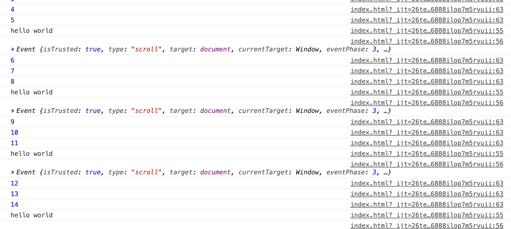
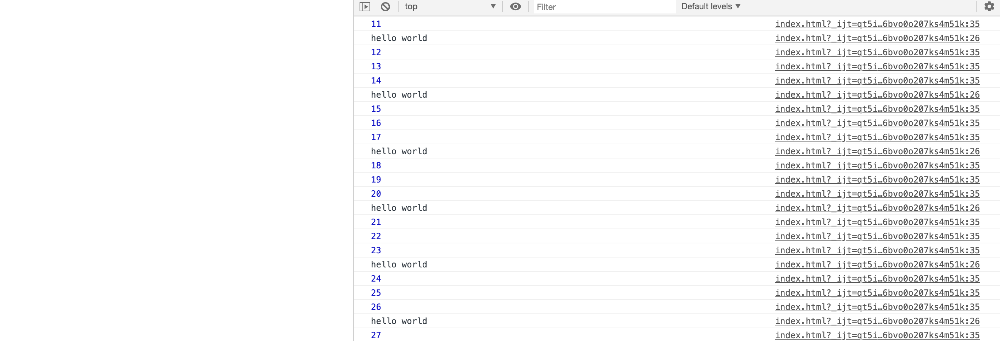

# 函数节流与函数防抖
### 应用场景

函数节流和防抖在开发中非常常见，浏览器页面滚动 、 Input输入 、 window.onresize、鼠标事件( onmouseover）等，总结来说是在短时间内触发非常频繁的事件。

### 概念

### 函数节流（throttle）

> 某个函数在一定时间间隔内（例如 3 秒）只执行一次，在这 3 秒内 **无视后来产生的函数调用请求**，也不会延长时间间隔

预先设定一个执行周期，当调用动作的时刻大于等于执行周期则执行该动作，然后进入下一个新周期。


### 函数防抖（debounce）

>当调用动作过n毫秒后，才会执行该动作，若在这n毫秒内又调用此动作则将重新计算执行时间
函数节流（throttle）与 函数防抖（debounce）都是为了限制函数的执行频次，以优化函数触发频率过高导致的响应速度跟不上触发频率，出现延迟，假死或卡顿的现象。

说一下我的理解：

**节流**的特点： 有时间规律的调用。

**防抖**的特点： 密集性操作之后才触发调用。第二次密集性操作和第一次有时间间隔


比如如下的情况：

window对象的resize、scroll事件
拖拽时的mousemove事件
文字输入、自动完成的keyup事件
区别
可以拿我们平时坐电梯为例来形象地表述二者的区别

函数防抖：如果有人进电梯（触发事件），那电梯将在10秒钟后出发（执行事件监听器），这时如果又有人进电梯了（在10秒内再次触发该事件），我们又得等10秒再出发（重新计时）。
函数节流 ：保证如果电梯第一个人进来后，10秒后准时运送一次，这个时间从第一个人上电梯开始计时，不等待，如果没有人，则不运行

实现
*函数防抖（debounce）*

``` js
function _debounce(fn,wait){
    var timer = null;
    return function(){
        clearTimeout(timer)
        timer = setTimeout(()=>{
            fn()
        },wait)
    }
}

function _log(){
    console.log(1)
}
window.onscroll = _debounce(_log,500)
```

*函数节流（throttle）*
仔细想想，上面的防抖方式还是有一定的缺点。如果页面很长，我们一直在滚动页面，那_log方法就一直不会被执行。所以我们可以升级一下上述的防抖方法。

```js
function _throttle(fn,wait,time){
    var previous = null; //记录上一次运行的时间
    var timer = null;

    return function(){
        var now = +new Date();

        if(!previous) previous = now;
        //当上一次执行的时间与当前的时间差大于设置的执行间隔时长的话，就主动执行一次
        if(now - previous > time){
            clearTimeout(timer);
            fn();
            previous = now;// 执行函数后，马上记录当前时间
        }else{
            clearTimeout(timer);
            timer = setTimeout(function(){
                fn();
            },wait);
        }
    }
}
function _log(){
    console.log(1)
}
window.onscroll = _debounce(_log,500,2000)
```
其实，这就实现了我们的函数节流。赶快打开控制台运行一下吧~

函数节流把要触发的函数根据时间段划分开来，那么就有两种方法实现：

1. 时间戳记录法。函数每一次执行时，都和上一次执行的时间做差，如果大于时间间隔，那么执行操作，记录当前时间戳，下一次调用时，运用同样的方法，以此类推。
2. setTimeout 定时器法。函数执行时，判断当前有没有定时器，如果有，说明在时间段内，不操作。如果没有，那么执行操作，并且创建一个新的定时器setTimeout，并设置好消除时间。

第一种写法：

```javascript
//节流函数，时间戳法
function fn1(fn, wait) {
        let lastTime = 0;
        return function (...args) {
            let nowTime = new Date().getTime();
            if ((nowTime - lastTime) > wait) {
                lastTime = nowTime;
                //执行你的代码
                fn.apply(this, args); //这里把 event 对象传递进去
            }
        }
    }

    let betterFn = fn1((e) => {
        console.log('hello world');
        console.log(e);
    }, 3000);
    window.onscroll = betterFn;
```

第二种写法： 

```javascript
//节流函数，定时器法
let timer = null;
let number = 0;
    function fn() {

        if (!timer) {
            console.log('hello world');
            timer = setTimeout(() => {
                timer = null;
            }, 3000)
        }
    }

    // window.onscroll = fn;
```


为了更加直观的看**函数节流**的调用规律，我添加了以下检测函数。

```
//检测函数
let timer2 = setInterval(() => {
    console.log(number++);
}, 1000);
setTimeout(() => {
    clearInterval(timer2)
}, 20000);
```







https://zhuanlan.zhihu.com/p/38313717