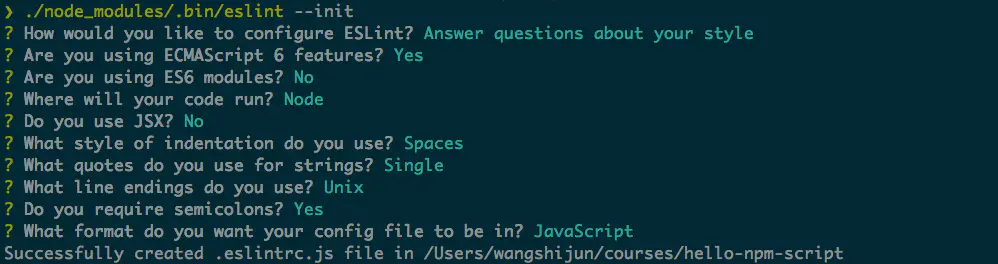

---
2020.5.13
---
1.1 初识 npm script
首先介绍创建 package.json 文件的科学方法，目标是掌握 npm init 命令。然后，通过在终端中运行自动生成的 test 命令，详细讲解 npm 脚本基本执行流程。 然后，动手给项目增加 eslint 命令，熟悉创建自定义命令的基本流程。

用 npm init 快速创建项目
开始探索 npm script 之前，我们先聊聊这些 scripts 所依赖的文件 package.json，以它为基础的 npm 则是 node.js 社区蓬勃发展的顶梁柱。

npm 为我们提供了快速创建 package.json 文件的命令 npm init，执行该命令会问几个基本问题，如包名称、版本号、作者信息、入口文件、仓库地址、许可协议等，多数问题已经提供了默认值，你可以在问题后敲回车接受默认值：

```Code
package name: (hello-npm-script)
version: (0.1.0)
description: hello npm script
entry point: (index.js)
test command:
git repository:
keywords: npm, script
license: (MIT)
```


上面的例子指定了描述（description）和关键字（keywords）两个字段，基本问题问完之后 npm 会把 package.json 文件内容打出来供你确认：

```Code
{
  "name": "hello-npm-script",
  "version": "0.1.0",
  "description": "hello npm script",
  "main": "index.js",
  "scripts": {
    "test": "echo \"Error: no test specified\" && exit 1"
  },
  "keywords": [
    "npm",
    "script"
  ],
  "author": "wangshijun <wangshijun2010@gmail.com> (https://github.com/wangshijun)",
  "license": "MIT"
}
```

按回车确认就能把package.json 的内容写到文件系统，如果要修改 package.json，可以直接用编辑器编辑，或者再次运行 npm init，npm 默认不会覆盖修改里面已经存在的信息。

> TIP#1: 嫌上面的初始化方式太啰嗦？你可以使用 npm init -f（意指 –force，或者使用 –yes）告诉 npm 直接跳过参数问答环节，快速生成 package.json。

初始化 package.json 时的字段默认值是可以自己配置的，细心的同学可能已经发现，我上面的默认版本号是 0.1.0，而 npm 默认的版本号是 0.0.1，可以用下面的命令去修改默认配置：

```Code
npm config set init.author.email "wangshijun2010@gmail.com"
npm config set init.author.name "wangshijun"
npm config set init.author.url "http://github.com/wangshijun"
npm config set init.license "MIT"
npm config set init.version "0.1.0"
```

> TIP#2: 将默认配置和 -f 参数结合使用，能让你用最短的时间创建 package.json，快去自己试试吧。

严肃的工程师都会使用 Git 对源代码进行版本管理，在 npm init 的基础上，你可以使用 git init 来初始化 git 仓库，不再展开。

纸上得来终觉浅，想掌握 npm script，请打开终端，执行下列命令：

```Code
cd ~
mkdir hello-npm-script && cd $_
npm init
npm init -f
```

### 用 npm run 执行任意命令

npm 是如何管理和执行各种 scripts 的呢？作为 npm 内置的核心功能之一，npm run 实际上是 npm run-script 命令的简写。当我们运行 npm run xxx 时，基本步骤如下：

1. 从 package.json 文件中读取 scripts 对象里面的全部配置；
2. 以传给 npm run 的第一个参数作为键，本例中为 xxx，在 scripts 对象里面获取对应的值作为接下来要执行的命令，如果没找到直接报错；
3. 在系统默认的 shell 中执行上述命令，系统默认 shell 通常是 bash，windows 环境下可能略有不同，稍后再讲。

注意，上面这是简化的流程，更复杂的钩子机制后面章节单独介绍。

举例来说，如果 package.json 文件内容如下：

```Code
{
  "name": "hello-npm-script",
  "devDependencies": {
    "eslint": "latest"
  },
  "scripts": {
    "eslint": "eslint **.js"
  }
}
```

如果不带任何参数执行 npm run，它会列出可执行的所有命令，比如下面这样：

```Code
Available scripts in the myproject package:
  eslint
    eslint **.js
```

如果运行 npm run eslint，npm 会在 shell 中运行 eslint **.js。

有没有好奇过上面的 eslint 命令是从哪里来的？其实，npm 在执行指定 script 之前会把 node_modules/.bin 加到环境变量 $PATH 的前面，这意味着任何内含可执行文件的 npm 依赖都可以在 npm script 中直接调用，换句话说，你不需要在 npm script 中加上可执行文件的完整路径，比如 ./node_modules/.bin/eslint **.js。


### 创建自定义 npm script

知道如何运行 npm script 之后，接下来我们在 hello-npm-script 项目中添加有实际用途的 eslint 脚本，eslint 是社区中接受度比较高的 javascript 风格检查工具，有大把现成的规则集可供你选择，比如 google、 airbnb。

在新项目或者任何现有项目中添加 eslint 自定义脚本的步骤如下：

1. 准备被检查的代码

要做代码检查，我们必须有代码，创建 index.js 文件，输入如下内容：

```Code
const str = 'some value';

function fn(){
    console.log('some log');
}
```

2. 添加 eslint 依赖

执行如下命令将 eslint 添加为 devDependencies：

```Code
npm install eslint -D
```
3. 初始化 eslint 配置
用 eslint 做检查需要配置规则集，存放规则集的文件就是配置文件，使用如下文件生成配置文件：

```Code
./node_modules/.bin/eslint --init
```
> TIP#3: 把 eslint 安装为项目依赖而非全局命令，项目可移植性更高。

在命令行提示中选择 Answer questions about your style，如下图回答几个问题，答案可以根据自己的偏好：


回车后根目录下就有了 .eslintrc.js 配置文件：

```Code
module.exports = {
  env: {
    es6: true,
    node: true,
  },
  extends: 'eslint:recommended',
  rules: {
    indent: ['error', 4],
    'linebreak-style': ['error', 'unix'],
    quotes: ['error', 'single'],
    semi: ['error', 'always'],
  },
};
```
4. 添加 eslint 命令
在 package.json 的 scripts 字段中新增命令 eslint：

```Code
{
  "scripts": {
    "eslint": "eslint *.js",
    "test": "echo \"Error: no test specified\" && exit 1"
  },
}
```
手动修改 package.json 时一定要注意语法正确。

5. 运行 eslint 命令

执行 npm run eslint，可以看到，按照官方推荐规则代码里有 3 处不符合规范的地方：

20171205 增补：eslint 完成 react、vue.js 代码的检查
如果需要结合 eslint 检查主流前端框架 react、vue.js，下面提供两条线索，因为官方仓库的 README 就可以作为入门文档，仔细读读相信绝大多数同学都能配置好。

使用 eslint-plugin-react 检查 react 代码，使用 react-plugin-react-native 检查 react-native 代码，如果你比较懒，可以直接使用 eslint-config-airbnb，里面内置了 eslint-plugin-react，新人常遇到 peerDependencies 安装失败问题可参照 npmjs 主页上的如下方法解决：

```Code
(
  export PKG=eslint-config-airbnb;
  npm info "$PKG@latest" peerDependencies --json | command sed 's/[\{\},]//g ; s/: /@/g' | xargs npm install --save-dev "$PKG@latest"
)
```
推荐使用 vue.js 官方的 eslint 插件：eslint-plugin-vue 来检查 vue.js 代码，具体的配置方法官方 README 写的清晰明了，这里就不赘述了。

上面的几种 eslint 规则集的官方仓库都列出了各自支持的规则，如果你需要关闭某些规则，可以直接在自己的 .eslintrc* 里面的 rules 中配置，比如我们仓库里面的：

```Code
module.exports = {
  env: {
    es6: true,
    node: true,
  },
  extends: 'eslint:recommended',
  rules: {
    indent: ['error', 2],
    'linebreak-style': ['error', 'unix'],
    quotes: ['error', 'single'],
    semi: ['error', 'always'],
  },
};
```

20171205 增补：eslint 完成 react、vue.js 代码的检查
如果需要结合 eslint 检查主流前端框架 react、vue.js，下面提供两条线索，因为官方仓库的 README 就可以作为入门文档，仔细读读相信绝大多数同学都能配置好。

使用 eslint-plugin-react 检查 react 代码，使用 react-plugin-react-native 检查 react-native 代码，如果你比较懒，可以直接使用 eslint-config-airbnb，里面内置了 eslint-plugin-react，新人常遇到 peerDependencies 安装失败问题可参照 npmjs 主页上的如下方法解决：

```Code
(
  export PKG=eslint-config-airbnb;
  npm info "$PKG@latest" peerDependencies --json | command sed 's/[\{\},]//g ; s/: /@/g' | xargs npm install --save-dev "$PKG@latest"
)
```

推荐使用 vue.js 官方的 eslint 插件：eslint-plugin-vue 来检查 vue.js 代码，具体的配置方法官方 README 写的清晰明了，这里就不赘述了。

上面的几种 eslint 规则集的官方仓库都列出了各自支持的规则，如果你需要关闭某些规则，可以直接在自己的 .eslintrc* 里面的 rules 中配置，比如我们仓库里面的：

```Code
module.exports = {
  env: {
    es6: true,
    node: true,
  },
  extends: 'eslint:recommended',
  rules: {
    indent: ['error', 2],
    'linebreak-style': ['error', 'unix'],
    quotes: ['error', 'single'],
    semi: ['error', 'always'],
  },
};
```

### 1.2 运行多个 npm script 的各种姿势
前端项目通常会包括多个 npm script，对多个命令进行编排是很自然的需求，有时候需要将多个命令串行，即脚本遵循严格的执行顺序；有时候则需要让它们并行来提高速度，比如不相互阻塞的 npm script。社区中也有比 npm 内置的多命令运行机制更好用的解决方案：npm-run-all。

#### 哪来那么多命令？
通常来说，前端项目会包含 js、css、less、scss、json、markdown 等格式的文件，为保障代码质量，给不同的代码添加检查是很有必要的，代码检查不仅保障代码没有低级的语法错误，还可确保代码都遵守社区的最佳实践和一致的编码风格，在团队协作中尤其有用，即使是个人项目，加上代码检查，也会提高你的效率和质量。

我通常会给前端项目加上下面 4 种代码检查：

- eslint，可定制的 js 代码检查，1.1 中有详细的配置步骤；
- stylelint，可定制的样式文件检查，支持 css、less、scss；
- jsonlint，json 文件语法检查，踩过坑的同学会清楚，json 文件语法错误会知道导致各种失败；
- markdownlint-cli，Markdown 文件最佳实践检查，个人偏好；
需要注意的是，html 代码也应该检查，但是工具支持薄弱，就略过不表。此外，为代码添加必要的单元测试也是质量保障的重要手段，常用的单测技术栈是：

- mocha，测试用例组织，测试用例运行和结果收集的框架；
- chai，测试断言库，必要的时候可以结合 sinon 使用；
TIP#4：测试工具如 tap、ava 也都提供了命令行接口，能很好的集成到 npm script 中，原理是相通的。

包含了基本的代码检查、单元测试命令的 package.json 如下：

```Code
{
  "name": "hello-npm-script",
  "version": "0.1.0",
  "main": "index.js",
  "scripts": {
    "lint:js": "eslint *.js",
    "lint:css": "stylelint *.less",
    "lint:json": "jsonlint --quiet *.json",
    "lint:markdown": "markdownlint --config .markdownlint.json *.md",
    "test": "mocha tests/"
  },
  "devDependencies": {
    "chai": "^4.1.2",
    "eslint": "^4.11.0",
    "jsonlint": "^1.6.2",
    "markdownlint-cli": "^0.5.0",
    "mocha": "^4.0.1",
    "stylelint": "^8.2.0",
    "stylelint-config-standard": "^17.0.0"
  }
}
```

#### 让多个 npm script 串行？
在我们运行测试之前确保我们的代码都通过代码检查会是比较不错的实践，这也是让多个 npm script 串行的典型用例，实现方式也比较简单，只需要用 && 符号把多条 npm script 按先后顺序串起来即可，具体到我们的项目，修改如下图所示：

```Code
diff --git a/package.json b/package.json
index c904250..023d71e 100644
--- a/package.json
+++ b/package.json
@@ -8,7 +8,7 @@
-    "test": "mocha tests/"
+    "test": "npm run lint:js && npm run lint:css && npm run lint:json && npm run lint:markdown && mocha tests/"
   },
```
然后直接执行 npm test 或 npm t，从输出可以看到子命令的执行顺序是严格按照我们在 scripts 中声明的先后顺序来的：

```Code
eslint ==> stylelint ==> jsonlint ==> markdownlint ==> mocha
```

需要注意的是，串行执行的时候如果前序命令失败（通常进程退出码非0），后续全部命令都会终止，我们可以尝试在 index.js 中引入错误（删掉行末的分号）：

```
diff --git a/index.js b/index.js
index ab8bd0e..b817ea4 100644
--- a/index.js
+++ b/index.js
@@ -4,7 +4,7 @@ const add = (a, b) => {
   }

   return NaN;
-};
+}

 module.exports = { add  };
 ```
 然后重新运行 npm t，结果如下，npm run lint:js 失败之后，后续命令都没有执行：

#### 让多个 npm script 并行？
在严格串行的情况下，我们必须要确保代码中没有编码规范问题才能运行测试，在某些时候可能并不是我们想要的，因为我们真正需要的是，代码变更时同时给出测试结果和测试运行结果。这就需要把子命令的运行从串行改成并行，实现方式更简单，把连接多条命令的 && 符号替换成 & 即可。

代码变更如下：

```Code
diff --git a/package.json b/package.json
index 023d71e..2d9bd6f 100644
--- a/package.json
+++ b/package.json
@@ -8,7 +8,7 @@
-    "test": "npm run lint:js && npm run lint:css && npm run lint:json && npm run lint:markdown && mocha tests/"
+    "test": "npm run lint:js & npm run lint:css & npm run lint:json & npm run lint:markdown & mocha tests/"
   },
```

重新运行 npm t，我们得到如下结果：


细心的同学可能已经发现上图中哪里不对，npm run lint:js 的结果在进程退出之后才输出，如果你自己运行，不一定能稳定复现这个问题，但 npm 内置支持的多条命令并行跟 js 里面同时发起多个异步请求非常类似，它只负责触发多条命令，而不管结果的收集，如果并行的命令执行时间差异非常大，上面的问题就会稳定复现。怎么解决这个问题呢？

答案也很简单，在命令的增加 & wait 即可，这样我们的 test 命令长这样：

```Code
npm run lint:js & npm run lint:css & npm run lint:json & npm run lint:markdown & mocha tests/ & wait
```
加上 wait 的额外好处是，如果我们在任何子命令中启动了长时间运行的进程，比如启用了 mocha 的 --watch 配置，可以使用 ctrl + c 来结束进程，如果没加的话，你就没办法直接结束启动到后台的进程。

### 有没有更好的管理方式？
有强迫症的同学可能会觉得像上面这样用原生方式来运行多条命令很臃肿，幸运的是，我们可以使用 npm-run-all 实现更轻量和简洁的多命令运行。

用如下命令将 npm-run-all 添加到项目依赖中：

```Code
npm i npm-run-all -D
然后修改 package.json 实现多命令的串行执行：
```

```Code
diff --git a/package.json b/package.json
index b3b1272..83974d6 100644
--- a/package.json
+++ b/package.json
@@ -8,7 +8,8 @@
-    "test": "npm run lint:js & npm run lint:css & npm run lint:json & npm run lint:markdown & mocha tests/ & wait"
+    "mocha": "mocha tests/",
+    "test": "npm-run-all lint:js lint:css lint:json lint:markdown mocha"
   },
```

npm-run-all 还支持通配符匹配分组的 npm script，上面的脚本可以进一步简化成：

```Code
diff --git a/package.json b/package.json
index 83974d6..7b327cd 100644
--- a/package.json
+++ b/package.json
@@ -9,7 +9,7 @@
-    "test": "npm-run-all lint:js lint:css lint:json lint:markdown mocha"
+    "test": "npm-run-all lint:* mocha"
   },
```

如何让多个 npm script 并行执行？也很简单：

```Code
diff --git a/package.json b/package.json
index 7b327cd..c32da1c 100644
--- a/package.json
+++ b/package.json
@@ -9,7 +9,7 @@
-    "test": "npm-run-all lint:* mocha"
+    "test": "npm-run-all --parallel lint:* mocha"
   },
```

并行执行的时候，我们并不需要在后面增加 & wait，因为 npm-run-all 已经帮我们做了。

> TIP#5：npm-run-all 还提供了很多配置项支持更复杂的命令编排，比如多个命令并行之后接串行的命令，感兴趣的同学请阅读文档，自己玩儿。

### 1.3 给 npm script 传递参数和添加注释

本小节会介绍 3 个知识点：给 npm script 传递参数以减少重复的 npm script；增加注释提高 npm script 脚本的可读性；控制运行时日志输出能让你专注在重要信息上。

给 npm script 传递参数
eslint 内置了代码风格自动修复模式，只需给它传入 --fix 参数即可，在 scripts 中声明检查代码命令的同时你可能也需要声明修复代码的命令，面对这种需求，大多数同学可能会忍不住复制粘贴，如下：

```Code
diff --git a/package.json b/package.json
index c32da1c..b6fb03e 100644
--- a/package.json
+++ b/package.json
@@ -5,6 +5,7 @@
     "lint:js": "eslint *.js",
+    "lint:js:fix": "eslint *.js --fix",
```
在 lint:js 命令比较短的时候复制粘贴的方法简单粗暴有效，但是当 lint:js 命令变的很长之后，难免后续会有人改了 lint:js 而忘记修改 lint:js:fix（别问我为啥，我就是踩着坑过来的），更健壮的做法是，在运行 npm script 时给定额外的参数，代码修改如下：

```Code
diff --git a/package.json b/package.json
--- a/package.json
+++ b/package.json
@@ -5,6 +5,7 @@
     "lint:js": "eslint *.js",
+    "lint:js:fix": "npm run lint:js -- --fix",
```
要格外注意 --fix 参数前面的 -- 分隔符，意指要给 npm run lint:js 实际指向的命令传递额外的参数。

运行效果如下图：

上图第2个红色框里面是实际执行的命令，可以看到 --fix 参数附加在了后面。

> TIP#6：如果你不想单独声明 lint:js:fix 命令，在需要的时候直接运行： npm run lint:js -- --fix 来实现同样的效果。


问题来了，如果我想为 mocha 命令增加 --watch 模式方便在开发时立即看到测试结果，该怎么做呢？相信读到这里你心中已经有了答案。

:stuck_out_tongue:
### 给 npm script 添加注释

如果 package.json 中的 scripts 越来越多，或者出现复杂的编排命令，你可能需要给它们添加注释以保障代码可读性，但 json 天然是不支持添加注释的，下面是 2 种比较 trick 的方式。

第一种方式是，package.json 中可以增加 // 为键的值，注释就可以写在对应的值里面，npm 会忽略这种键，比如，我们想要给 test 命令添加注释，按如下方式添加：

```Code
diff --git a/package.json b/package.json
--- a/package.json
+++ b/package.json
@@ -10,6 +10,7 @@
+    "//": "运行所有代码检查和单元测试",
     "test": "npm-run-all --parallel lint:* mocha"
```
这种方式的明显不足是，npm run 列出来的命令列表不能把注释和实际命令对应上，如果你声明了多个，npm run 只会列出最后那个，如下图：

另外一种方式是直接在 script 声明中做手脚，因为命令的本质是 shell 命令（适用于 linux 平台），我们可以在命令前面加上注释，具体做法如下：

```Code
diff --git a/package.json b/package.json
--- a/package.json
+++ b/package.json
@@ -10,8 +10,7 @@
-    "//": "运行所有代码检查和单元测试",
-    "test": "npm-run-all --parallel lint:* mocha"
+    "test": "# 运行所有代码检查和单元测试 \n    npm-run-all --parallel lint:* mocha"
```

注意注释后面的换行符 \n 和多余的空格，换行符是用于将注释和命令分隔开，这样命令就相当于微型的 shell 脚本，多余的空格是为了控制缩进，也可以用制表符 \t 替代。这种做法能让 npm run 列出来的命令更美观，但是 scripts 声明阅读起来不那么整齐美观。


上面两种方式都有明显的缺陷，个人建议的更优方案还是把复杂的命令剥离到单独的文件中管理，在单独的文件中可以自由给它添加注释，详见后续章节。

### 调整 npm script 运行时日志输出
在运行 npm script 出现问题时你需要有能力去调试它，某些情况下你需要让 npm script 以静默的方式运行，这类需求可通过控制运行时日志输出级别来实现。

日志级别控制参数有好几个，简单举例如下：
#### 默认日志输出级别
即不加任何日志控制参数得到的输出，可能是你最常用的，能看到执行的命令、命令执行的结果。

#### 显示尽可能少的有用信息
结合其他工具调用 npm script 的时候比较有用，需要使用 --loglevel silent，或者 --silent，或者更简单的 -s 来控制，这个日志级别的输出实例如下（只有命令本身的输出，读起来非常的简洁）：


如果执行各种 lint script 的时候启用了 -s 配置，代码都符合规范的话，你不会看到任何输出，这就是没有消息是最好的消息的由来，哈哈！

### npm7npm显示尽可能多的运行时状态
排查脚本问题的时候比较有用，需要使用 --loglevel verbose，或者 --verbose，或者更简单的 -d 来控制，这个日志级别的输出实例如下（详细打印出了每个步骤的参数、返回值，下面的截图只是部分）：

