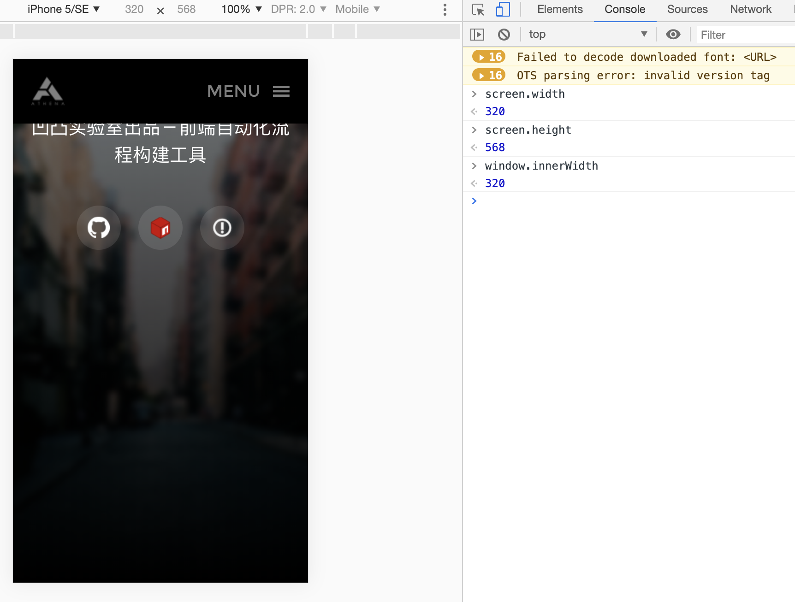
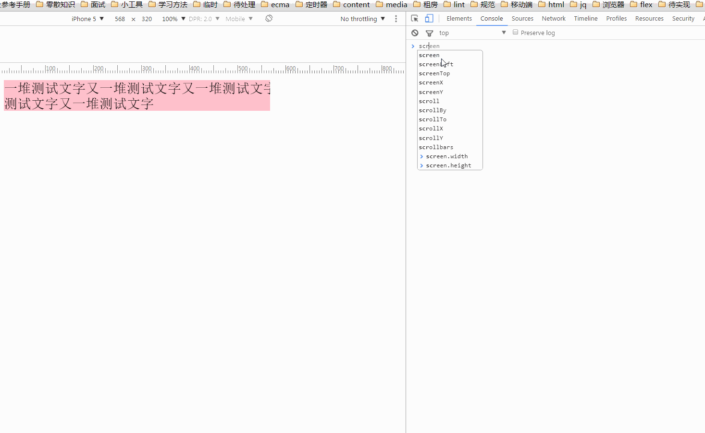

Dpr:设备像素比。

像素分两类：设备独立像素和物理像素。

### 定义

　　像素，又称画素，是图像显示的基本单位，译自英文“pixel”，pix是英语单词picture的常用简写，加上英语单词“元素”element，就得到pixel，故“像素”表示“图像元素”之意，有时亦被称为pel(picture element)

　　像素是网页布局的基础。一个像素就是计算机能够显示一种特定颜色的最小区域。当设备尺寸相同但像素变得更密集时，屏幕能显示的画面的过渡更细致，网站看起来更明快。

　　//ppi是指屏幕上每英寸可以显示的像素点的数量，即屏幕像素密度

### 分类

　　实际上像素分为两种：**设备像素和CSS像素**

　　1、设备像素(device independent pixels): 设备屏幕的物理像素，任何设备的物理像素的数量都是固定的

　　2、CSS像素(CSS pixels): 又称为逻辑像素，是为web开发者创造的，在CSS和javascript中使用的一个抽象的层

　　每一个CSS声明和几乎所有的javascript属性都使用CSS像素，因此实际上从来用不上设备像素 ，唯一的例外是screen.width/height，`screen.width`表示设备宽度的像素值




我们通过CSS和javascript代码设置的像素都是逻辑像素
``` css
width:300px;
font-size:16px;
```

### 缩放

　　在桌面端，css的1个像素往往都是对应着电脑屏幕的1个物理像素。

　　//一个CSS像素完全覆盖了一个设备像素


而在手机端，由于屏幕尺寸的限制，缩放是经常性的操作。

　　//设备像素(深蓝色背景)、CSS像素(半透明背景)
　　//左图表示当用户进行缩小操作时，一个设备像素覆盖了多个CSS像素


　　//右图表示当用户进行放大操作时，一个CSS像素覆盖了多个设备像素


不论我们进行缩小或放大操作，元素设置的CSS像素(如width:300px)是始终不变的，而一个CSS像素对应多少个设备像素是根据当前的缩放比例来决定的

### DPR


　　设备像素比DPR(devicePixelRatio)是默认缩放为100%的情况下，设备像素和CSS像素的比值

```
DPR = 设备像素 / CSS像素(某一方向上)
```

　　在早先的移动设备中，并没有DPR的概念。随着技术的发展，移动设备的屏幕像素密度越来越高。从iphone4开始，苹果公司推出了所谓的retina视网膜屏幕。之所以叫做视网膜屏幕，是因为屏幕的PPI(屏幕像素密度)太高，人的视网膜无法分辨出屏幕上的像素点。iphone4的分辨率提高了一倍，但屏幕尺寸却没有变化，这意味着同样大小的屏幕上，像素多了一倍，于是DPR = 2

实际上，此时的CSS像素对应着以后要提到的理想视口，其对应的javascript属性是`screen.width`/`screen.height`

　　而对于设备像素比DPR也有对应的javascript属性window.devicePixelRatio

　　以iphone5为例，iphone5的CSS像素为320px*568px，DPR是2，所以其设备像素为640px*1136px

```javascript
640(px) / 320(px)  = 2
1136(px) / 568(px) = 2
640(px)*1136(px) /  320(px)*568(px) = 4
```



