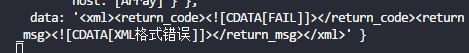
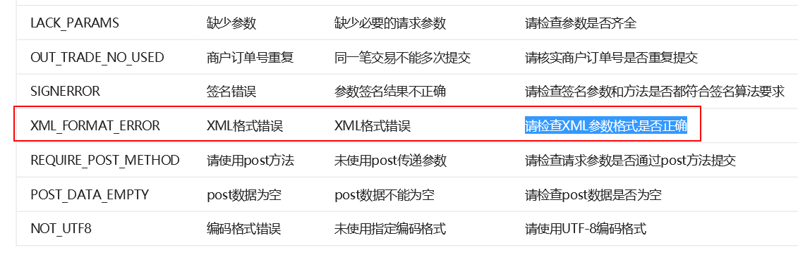
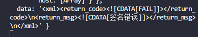
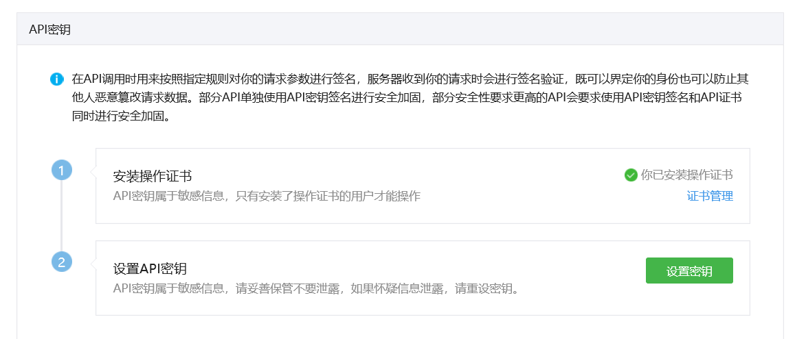
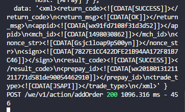
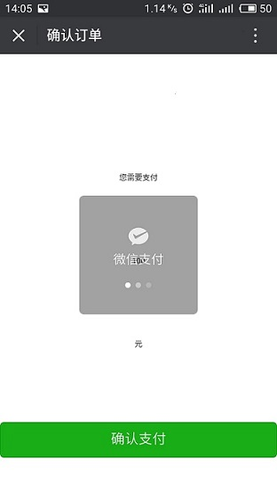
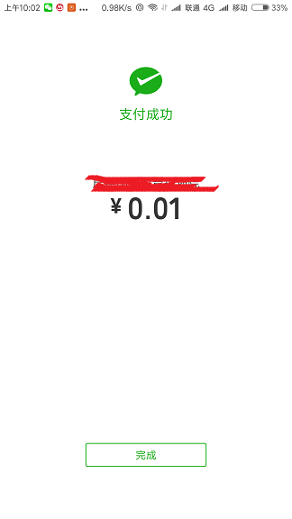

> 凡是和钱打交道的事，没有一样是容易的。这是我第一次接触微信支付，发现网上还是有很多同学在求助，XXX了怎么办？XXX是什么情况？为了帮助更多的小伙伴脱离“苦海”，我决定写下这次的踩坑之旅，给更多的人帮助。

### 介绍

微信支付方式分为刷卡支付、公众号支付、扫码支付、APP支付、H5支付、小程序支付。

先从应用场景来各自说一说，这样，能够最快的判断出应该选择哪一种支付。

- 刷卡支付：使用扫描设备（扫描枪）多见于超市、便利店使用
- 公众号支付：嵌入公众号的H5页面
- 扫码支付：用户打开“微信扫一扫”，扫描商户的二维码并支付
- APP支付：外部APP应用，用户触发支付时，转到微信内完成支付
- H5支付：非微信内置浏览器请求微信支付
- 小程序支付：用户在微信小程序中使用微信支付
 
### 背景

我们公司申请的是微信服务号，需要微信支付的是嵌入服务号内部的网页，所以根据介绍，应该选择“公众号支付”。

### 开发步骤

首先不要被微信支付的开发吓着，其实它很简单。先仔细看公众号支付的文档，看不懂的多看几遍，还看不懂的，动手操作一下，试一试。

文档在此[：微信支付统一下单](https://pay.weixin.qq.com/wiki/doc/api/jsapi.php?chapter=9_1)


- ### 步骤一：统一下单
跟着文档，咱一点点来，搞明白每一步是为什么，就不会迷迷糊糊搞不清楚了。

首先说一下，这个接口是后台需要完成的，这个接口的目的就是获取prepay_id,它是预支付交易回话标识。将prepay_id传给前台，前台调用js-sdk，这属于步骤二的范围了，一会讲。

接口链接  https://api.mch.weixin.qq.com/pay/unifiedorder

在文档中说明了，必须使用post 方法请求微信给的接口链接，传入的数据也必须是xml格式，返回的也是xml的。醉了？不要醉，微信是这样的，支付宝也是这样的。手动微笑，接受吧。

接着来。

简单粗暴贴代码：


```

// '/addOrder'是留给前台的调用接口
router.post('/addOrder',(req,res)=>{    
const addOrderUrl = 'https://api.mch.weixin.qq.com/pay/unifiedorder';    
var client_ip = "";    
client_ip = req.body.ipaddr;    
var appid = "1234567890"; // 服务号|公众号的appid    
var body = "商品简单描述-测试"; // 商品简单描述    
var mch_id= "1234567890"; // 商户号，申请微信支付，腾讯给的商户号    
// var device_info = "WEB";  
var nonce_str = getRanId(32); // 随机字符串 
var out_trade_no = "" +new Date().getTime() + Math.floor( Math.random() * 10 ); //商户订单号
var total_fee = req.body.total_fee; //支付金额，单位：分    
var sign = "";    
var notify_url = "http://123.456.789"; //异步接收微信支付结果通知的回调地址    
var trade_type = "JSAPI"; // 交易类型    
var openid = req.session.openId;    
console.log(openid);    
var stringA = `appid=${appid}&body=${body}&mch_id=${mch_id}&nonce_str=${nonce_str}&notify_url=${notify_url}&openid=${openid}&out_trade_no=${out_trade_no}&spbill_create_ip=${client_ip}&total_fee=${total_fee}&trade_type=${trade_type}`;    
var stringSighTemp = stringA+"&key=****#####jiaoyuguihuayuan----***"; //32位的商户key,自定义的，这里为了隐私，我用的特殊符号给你们展示   
sign = md5(stringSighTemp).toUpperCase();    
var xml = `<xml>      
<appid>${appid}</appid>      
<body>${body}</body>      
<mch_id>${mch_id}</mch_id>      
<nonce_str>${nonce_str}</nonce_str>      
<notify_url>${notify_url}</notify_url>     
<openid>${openid}</openid>     
<out_trade_no>${out_trade_no}</out_trade_no>    
<spbill_create_ip>${client_ip}</spbill_create_ip>     
<total_fee>${total_fee}</total_fee>  
<trade_type>${trade_type}</trade_type>    
<sign>${sign}</sign>    
</xml>`;
var Res = res;axios({  
    method: 'post',   
    url: addOrderUrl,   
    data: xml,   
    responseType: 'text/xml',   
    headers: {     
       'Content-Type': 'text/xml' 
    }
 }).then( res=>{   
    console.log(res)  
    Res.send(res.data)
 }).catch( err=>{   
    console.log( err)})
})

```

## 说明

client_ip 参数 是客户端的ip地址，本来我是在后台获取客户端ip地址的，因为我们使用了nginx代理，req.ip 返回的都是 ::ffff:127.0.0.1 这是IPV6格式的字符串。网上有一个答案对此做出了解释： stackoverflow.com/questions/2…

在这里，我用的一个网上的脚本在前台获取的， http://pv.sohu.com/cityjson?ie=utf-8
使用方法： window.ipaddr = returnCitySN[‘cip’];
其他的参数，都是参考微信支付的要求去写的。

### 出现的错误

- ### XML格式错误


而查看文档，原因是这样的



我：#&(%#@+%)，也不给个详细点的说明…

这种错误需要“顿悟”，我突然发现了我的错误。是我理解错了！我给body标签加了一个 <![CDATA[]]> 导致我的xml格式错误，其实是有detail字段才需要添加 <[CDATA[]]>， 其他的不需要。

我：咳咳，低级错误。注意看文档，按照要求来，既不多添什么，也不要少什么。

我把<[CDATA[]]>去掉之后，发现果真是这个原因，不再出现XML格式错误了，然而，还是高兴的太早，因为它报了签名错误。呵呵呵~

- ### 签名错误



文档中说的签名计算很严格：
第一步，设所有发送或者接收到的数据为集合M，将集合M内非空参数值的参数按照参数名ASCII码从小到大排序（字典序），使用URL键值对的格式（即key1=value1&key2=value2…）拼接成字符串stringA。

特别注意以下重要规则：
第一步，设所有发送或者接收到的数据为集合M，将集合M内非空参数值的参数按照参数名ASCII码从小到大排序（字典序），使用URL键值对的格式（即key1=value1&key2=value2…）拼接成字符串stringA。

◆ 参数名ASCII码从小到大排序（字典序）；
◆ 如果参数的值为空不参与签名；
◆ 参数名区分大小写； （公众号支付全是小写）
◆ 验证调用返回或微信主动通知签名时，传送的sign参数不参与签名，将生成的签名与该sign值作校验。
◆ 微信接口可能增加字段，验证签名时必须支持增加的扩展字段

第二步，在stringA最后拼接上key得到stringSignTemp字符串，并对stringSignTemp进行MD5运算，再将得到的字符串所有字符转换为大写，得到sign值signValue。

◆ key设置路径：微信商户平台(pay.weixin.qq.com)–>账户设置–>API安全–>密钥设置

这里我查阅了一些资料，看到过有这样几种错误情况：
key 看错了，这里应该写商户的key,而这个key 是用户手动设置的，长32位。注意：自己保存一份，因为设置好了之后是没法打开查看的。


还有一种错误，我觉得很离谱啊，body里面不能有中文，然而，我把body中的文字改为英文，发现并不能改变现状，其实用中文是可以的。

…

总之，找到的这些错误，通通对我的情况没用！

然后这又需要“顿悟”，原来stringA字符串我用了换行符把很长的字符隔开，这导致换行符被转换为Ascall码中的 \n 写进了签名里面，所以，sign错误，所以要么，把换行符通通去掉，要么用“”连接，舍弃。我把换行都去掉之后，就没有签名错误了。

当当当当 ~



终于完成了第一步，后台成功的返回了我们需要的prepay_id

这里为了安全，对于返回sign，和发送的sign进行对比，完全相等之后，才能把结果返回给前台。

 - **步骤二：调用微信js-sdk接口**

微信支付

发起一个微信支付请求

前台收到的是xml数据，要先解析一下，得到prepay_id

然后调用微信支付js-sdk，为了大家少走一些弯路，我先来正确的写法，关键步骤如下：

```
var {prepay_id,appid} = getInfo(res.data); //从后台数据中获取appid 和 prepay_id
nonceStr = getRanId(32);
timeStamp = new Date().getTime();
var stringA = "appId="+appid+"&nonceStr="+nonceStr+"&package=prepay_id="+prepay_id+"&signType=MD5&timeStamp="+timeStamp;
var stringSignTemp = stringA+"&key=****#####jiaoyuguihuayuan----***";
paySign = md5(stringSignTemp).toUpperCase();
window.wx.chooseWXPay({    
    timestamp: timeStamp, // 支付签名时间戳，注意微信jssdk中的所有使用timestamp字段均为小写。但最新版的支付后台生成签名使用的timeStamp字段名需大写其中的S字符    
    nonceStr: nonceStr, // 支付签名随机串，不长于 32 位    
    package: "prepay_id=" + prepay_id, // 统一支付接口返回的prepay_id参数值，提交格式如：prepay_id=\*\*\*）    
    signType: 'MD5', // 签名方式，默认为'SHA1'，使用新版支付需传入'MD5'    
    paySign: paySign, // 支付签名 
    success: function (res) {        
        // 支付成功后的回调函数        
        console.log(res)   
    },   
    fail: function(err){     
        console.log(err)  
    }
});

```
备注：prepay_id 通过微信支付统一下单接口拿到，paySign 采用统一的微信支付 Sign 签名生成方法，注意这里 appId 也要参与签名，appId 与 config 中传入的
appId 一致，即最后参与签名的参数有appId, timeStamp, nonceStr,
package, signType。

**注意，我要讲个坑点~**

*调用js-sdk时，签名中的字段都是小驼峰的写法，timeStamp是这样写的，但是wx.config中，timestamp 是全小写的，所以，亲们，千万不要搞错了，我在这里就被坑了好一会呢。*

写完签名之后，当你用微信web开发者工具去测试的话，就会看到，“不支持模拟”这样的提示。这个时候，不要犹豫，直接上真机去测试，这并不是我们的程序出现了问题。

**小tips**: 在真机上，我们是没有办法看到console出的一些调试信息，所以，要想个办法，可以用alert，也可以把调试信息打印在屏幕上面，我选择打印在屏幕上。这里要说一些，微信给的文档没有那么齐全，有一些是要试试才指导的，比如wx.config中的success和fail函数，参数信息怎么打印，其实是res.errMsg和err.errMsg.

上面我说的这些你都注意到了，但是微信支付的控件你依然调动不起来的话，可能是微信商户平台的开发配置出现了问题，在产品中心-开发配置-支付配置-公众号支付
中进行配置，配置的时候，注意一定要到最后一级目录，比如我要在cms.123.456/book/list/index.html页面中去进行微信支付，那么你的配置应该是 cms.123.456/book/list/

好了，开发中基本上所有的坑都提到了，这是建立在你配置没有出错的情况下。接下来，看看到底能不能真的支付。

完成
--




大功告成，让我想起了，最近流行的一句话，你这磨人的小妖精，微信支付！

希望能给你们带来帮助~
